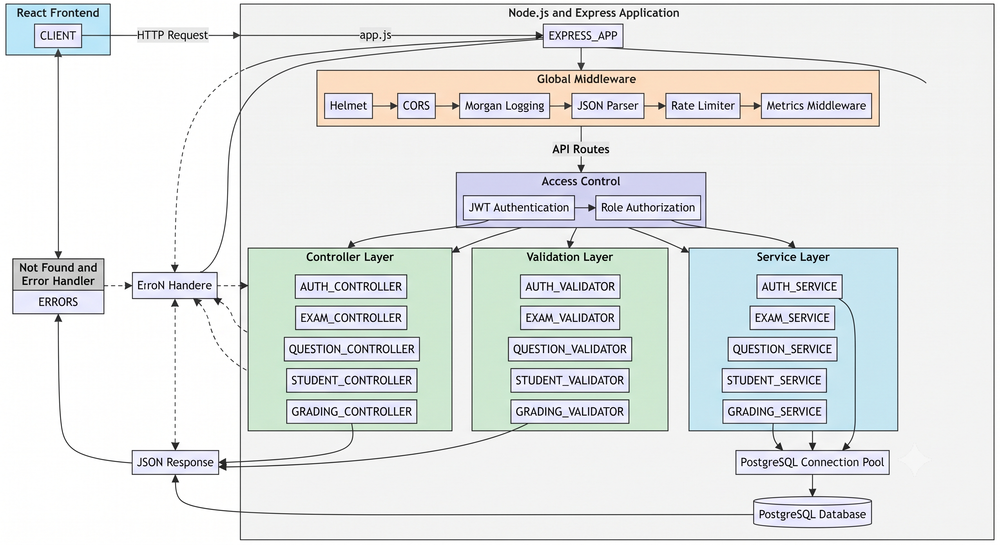

# Server Architecture

## Project Team

- Ameer Mresat
- Mohamed Kharanba

## 1. Server Overview

The server side of the Full Stack Exam Management System is a REST API developed with Node.js and Express.

The backend is responsible for:

- Receiving HTTP requests from the React frontend.
- Authenticating users.
- Authorizing operations according to user roles.
- Validating request data.
- Applying business rules.
- Communicating with PostgreSQL.
- Returning JSON responses.
- Handling errors.
- Producing HTTP logs.
- Exposing health, readiness, and monitoring endpoints.

The backend uses a layered architecture similar to MVC.

The project does not use traditional database model classes. Database operations are implemented in service functions using the PostgreSQL `pg` package.

---

## 2. Backend Technologies and Packages

| Package or Technology | Purpose |
| --- | --- |
| Node.js 18 | JavaScript server runtime |
| Express 5 | REST API framework |
| PostgreSQL | Persistent relational database |
| `pg` | PostgreSQL client and connection pool |
| `jsonwebtoken` | JWT creation and verification |
| `bcryptjs` | Password hashing and password verification |
| `Joi` | Request-data validation |
| `helmet` | HTTP security headers |
| `cors` | Cross-origin request configuration |
| `express-rate-limit` | API request throttling |
| `morgan` | HTTP request logging |
| `dotenv` | Environment-variable loading |
| `prom-client` | Prometheus metrics |
| `socket.io` | Installed foundation for future real-time features |
| `nodemon` | Automatic server restart during development |

---

## 3. Backend Folder Structure

```text
backend/
├── Dockerfile
├── package.json
├── package-lock.json
├── .env.example
└── src/
    ├── app.js
    ├── server.js
    ├── config/
    ├── controllers/
    ├── db/
    ├── middleware/
    ├── routes/
    ├── services/
    ├── validators/
    └── utils/
```

### Main Responsibilities

| Folder or File | Responsibility |
| --- | --- |
| `app.js` | Creates and configures the Express application |
| `server.js` | Starts the HTTP server and handles shutdown |
| `config/` | Environment and application configuration |
| `controllers/` | HTTP request and response handling |
| `db/` | PostgreSQL connection pool |
| `middleware/` | Authentication, authorization, errors, and cross-cutting logic |
| `routes/` | API endpoint definitions |
| `services/` | Business logic and SQL operations |
| `validators/` | Joi validation schemas |
| `utils/` | Shared helper functions |

---

## 4. Backend Architecture Pattern

The backend uses the following layered structure:

```text
HTTP Request
    |
    v
Express Route
    |
    v
Global Middleware
    |
    v
Authentication Middleware
    |
    v
Role Authorization Middleware
    |
    v
Controller
    |
    v
Joi Validator
    |
    v
Business Service
    |
    v
PostgreSQL Connection Pool
    |
    v
PostgreSQL Database
    |
    v
JSON Response
```

This structure separates different responsibilities.

### Routes

Routes define:

- HTTP method.
- URL path.
- Required middleware.
- Controller function.

### Controllers

Controllers:

- Read request parameters.
- Read request bodies.
- Read the authenticated user.
- Call validation schemas.
- Call services.
- Select the HTTP response status.
- Return JSON responses.

### Validators

Validators check:

- Required fields.
- Data types.
- Allowed values.
- Email format.
- Password requirements.
- UUID parameters.
- Exam dates.
- Exam durations.
- Question structure.
- Score values.

### Services

Services contain:

- Business rules.
- Ownership checks.
- Role-related logic.
- Database queries.
- Transactions.
- State changes.

### Database Layer

The database layer provides a shared PostgreSQL connection pool.

Services use this pool to execute SQL queries.

---

## 5. Application Startup

### `server.js`

The `server.js` file starts the HTTP server.

It is responsible for:

- Loading environment variables.
- Importing the Express application.
- Listening on the configured port.
- Logging server startup.
- Handling operating-system shutdown signals.
- Closing the server gracefully.

The default local port is:

```text
5000
```

The backend normally runs at:

```text
http://localhost:5000
```

### Graceful Shutdown

The server handles:

```text
SIGINT
SIGTERM
```

When a shutdown signal is received, the server stops accepting new requests and closes the HTTP server safely.

---

## 6. Express Application Configuration

### `app.js`

The Express application configures global middleware and API routes.

The general order is:

```text
Helmet
    |
    v
CORS
    |
    v
Morgan Logging
    |
    v
JSON Body Parser
    |
    v
Rate Limiter
    |
    v
Metrics Middleware
    |
    v
API Routes
    |
    v
Not-Found Middleware
    |
    v
Central Error Handler
```

Middleware order is important because Express processes middleware sequentially.

---

## 7. Global Middleware

### Helmet

Helmet adds security-related HTTP headers.

It helps reduce common browser-based risks.

### CORS

CORS controls which frontend origins may communicate with the backend.

For local development, the frontend normally runs at:

```text
http://localhost:5173
```

The production CORS origin should be configured using an environment variable.

### Morgan

Morgan logs HTTP requests.

Development mode normally uses:

```text
dev
```

Production mode normally uses:

```text
combined
```

### JSON Parser

Express parses JSON request bodies before controllers access them.

### Rate Limiter

The API rate limiter restricts excessive requests.

This reduces:

- Brute-force login attempts.
- Request flooding.
- Basic denial-of-service risks.

### Metrics Middleware

The backend records HTTP request metrics for Prometheus.

Metrics can include:

- HTTP method.
- Express route.
- Response status.
- Total request count.

---

## 8. Authentication Middleware

Authentication middleware protects private API endpoints.

The middleware performs the following steps:

1. Reads the `Authorization` request header.
2. Verifies that the header uses the Bearer format.
3. Extracts the JWT.
4. Verifies the JWT signature.
5. Reads the authenticated user information.
6. Attaches the user to the Express request.
7. Passes the request to the next middleware.

Protected requests contain:

```text
Authorization: Bearer <JWT>
```

If the token is missing or invalid, the backend returns an authentication error.

---

## 9. Role Authorization Middleware

Role middleware verifies whether the authenticated user has permission to access an endpoint.

Supported roles:

```text
ADMIN
LECTURER
STUDENT
```

Examples:

### Student Endpoints

Require:

```text
STUDENT
```

### Lecturer Management Endpoints

Require:

```text
LECTURER
ADMIN
```

### Administrator Route

Requires:

```text
ADMIN
```

Frontend route protection improves the user experience, but backend role middleware is the final authorization control.

---

## 10. Main Routes

### General Routes

```text
GET /health
GET /ready
GET /metrics
GET /api
GET /api/db-check
```

### Authentication Routes

```text
POST /api/auth/register
POST /api/auth/login
GET  /api/auth/me
```

### Lecturer Exam Routes

```text
POST   /api/exams
GET    /api/exams/my
GET    /api/exams/:id
PUT    /api/exams/:id
DELETE /api/exams/:id
PATCH  /api/exams/:id/publish
PATCH  /api/exams/:id/close
PATCH  /api/exams/:id/publish-results
```

### Question Routes

```text
POST   /api/exams/:examId/questions
GET    /api/exams/:examId/questions
PUT    /api/questions/:id
DELETE /api/questions/:id
```

### Student Routes

```text
GET   /api/student/exams/available
POST  /api/student/exams/:examId/start
GET   /api/student/exams/:examId
GET   /api/submissions/my
PATCH /api/submissions/:submissionId/auto-save
POST  /api/submissions/:submissionId/submit
GET   /api/submissions/:id/result
```

### Grading Routes

```text
GET   /api/exams/:examId/submissions
GET   /api/submissions/:id
PATCH /api/answers/:answerId/grade
PATCH /api/submissions/:id/grade
```

---

## 11. Main Controllers

### API Controller

Responsible for:

- API information.
- Database connectivity check.

### Authentication Controller

Responsible for:

- Registration requests.
- Login requests.
- Current-user requests.
- Authentication response formatting.

### Exam Controller

Responsible for:

- Creating exams.
- Returning lecturer exams.
- Returning one exam.
- Updating exams.
- Deleting exams.
- Publishing exams.
- Closing exams.
- Publishing results.

### Question Controller

Responsible for:

- Adding questions.
- Returning exam questions.
- Updating questions.
- Deleting questions.

### Student Exam Controller

Responsible for:

- Returning available exams.
- Starting exams.
- Returning student-safe exam details.
- Returning student submissions.
- Auto-saving answers.
- Submitting exams.
- Returning published results.

### Grading Controller

Responsible for:

- Returning exam submissions.
- Returning one submission for grading.
- Grading answers.
- Grading complete submissions.

---

## 12. Business Services

### Authentication Service

The authentication service handles:

- User lookup.
- User creation.
- Password hashing.
- Password comparison.
- JWT creation.
- Current-user retrieval.

Registration flow:

```text
Validate Request
    |
    v
Check Existing Email
    |
    v
Hash Password
    |
    v
Insert User
    |
    v
Create JWT
    |
    v
Return User and Token
```

Login flow:

```text
Validate Request
    |
    v
Find User by Email
    |
    v
Compare Password
    |
    v
Create JWT
    |
    v
Return User and Token
```

### Exam Service

The exam service handles:

- Exam creation.
- Lecturer ownership checks.
- Exam retrieval.
- Exam updates.
- Exam deletion.
- Exam publication.
- Exam closing.
- Result publication.

The service ensures that lecturers can manage only authorized exams.

### Question Service

The question service handles:

- Question creation.
- Question retrieval.
- Question updates.
- Question deletion.
- Question-option creation.
- Question-option updates.
- Question ordering.
- Exam ownership verification.

When a question and its options must be created together, the service may use a PostgreSQL transaction.

### Student Exam Service

The student exam service handles:

- Available-exam queries.
- Exam availability checks.
- Student exam-session creation.
- Submission creation.
- Student-safe question responses.
- Auto-save.
- Exam submission.
- Student submission history.
- Published-result retrieval.

The student-safe response must remove:

```text
correctAnswer
isCorrect
```

### Grading Service

The grading service handles:

- Submission-list retrieval.
- Submission details.
- Answer scoring.
- Answer feedback.
- Submission scoring.
- General feedback.
- Graded status updates.

The service verifies that the lecturer or administrator is authorized to grade the submission.

---

## 13. Validation Layer

The validation layer uses Joi.

Validation occurs before business services process user input.

### Authentication Validation

Checks:

- Full name.
- Email.
- Password.
- Requested role.

### Exam Validation

Checks:

- Exam title.
- Description.
- Duration.
- Start date.
- End date.
- Valid date order.

### Question Validation

Checks:

- Question text.
- Question type.
- Points.
- Position.
- Correct answer.
- Question options.

### Student Answer Validation

Checks:

- Submission ID.
- Question ID.
- Selected option.
- Written answer.

### Grading Validation

Checks:

- Answer score.
- Total score.
- Feedback.
- Non-negative values.

Validation errors are returned before invalid data reaches PostgreSQL.

---

## 14. Database Connection

The backend uses the `pg` package.

A shared connection pool is used instead of opening a new database connection for every request.

Logical flow:

```text
Service
    |
    v
PostgreSQL Pool
    |
    v
Available Database Connection
    |
    v
SQL Query
    |
    v
Query Result
    |
    v
Connection Returned to Pool
```

The connection string is read from:

```text
DATABASE_URL
```

The real database URL must be stored in a local environment file or managed secret service.

It must not be committed to Git.

---

## 15. Database Transactions

Transactions are useful when multiple related operations must succeed or fail together.

Example: creating a question with answer options.

```text
BEGIN
    |
    +-- Insert Question
    |
    +-- Insert Question Options
    |
    v
COMMIT
```

If an operation fails:

```text
ROLLBACK
```

Transactions protect the database from partially completed operations.

---

## 16. Error Handling

The backend uses centralized error handling.

### Not-Found Middleware

If no route matches the request, the backend returns a not-found response.

### Error Handler

The error handler receives errors from controllers and middleware.

It returns a consistent JSON response.

Example logical error response:

```json
{
  "success": false,
  "message": "The requested operation could not be completed."
}
```

Production responses should not expose:

- Stack traces.
- Database credentials.
- JWT secrets.
- Internal SQL details.
- Sensitive server configuration.

---

## 17. Backend Security

The backend implements:

- bcrypt password hashing.
- JWT authentication.
- Role-based authorization.
- Helmet headers.
- CORS restrictions.
- Request rate limiting.
- Joi validation.
- Centralized errors.
- Environment-based secrets.
- Kubernetes Secret references.

Important security rules:

- Plain-text passwords must not be stored.
- Password hashes must not be returned to the frontend.
- JWT secrets must not be committed.
- Database credentials must not be committed.
- Student responses must not expose correct answers.
- Ownership checks must be performed on protected resources.
- Production traffic should use HTTPS.

---

## 18. Health, Readiness, and Monitoring

### Health Endpoint

```text
GET /health
```

Confirms that the backend application process is running.

### Readiness Endpoint

```text
GET /ready
```

Provides backend readiness information.

### Database Check

```text
GET /api/db-check
```

Tests PostgreSQL connectivity.

### Metrics Endpoint

```text
GET /metrics
```

Exposes Prometheus-compatible metrics.

Prometheus collects metrics from:

```text
backend-service:5000/metrics
```

Grafana displays monitoring dashboards based on Prometheus data.

---

## 19. Logging

Morgan logs HTTP requests.

A log entry may include:

- HTTP method.
- Requested path.
- Response status.
- Response size.
- Request duration.
- Client information.

Kubernetes logs can be viewed using:

```bash
kubectl logs -n exam-system deployment/backend
```

Logs should not include:

- Passwords.
- JWT tokens.
- Private keys.
- Database passwords.
- Sensitive personal data.

---

## 20. Environment Variables

The backend configuration is loaded using `dotenv`.

Typical variables include:

```text
PORT
NODE_ENV
DATABASE_URL
JWT_SECRET
CORS_ORIGIN
```

### Local Development

Local values are stored in:

```text
backend/.env
```

### Safe Template

A safe example is stored in:

```text
backend/.env.example
```

### Kubernetes

Non-secret values belong in a ConfigMap.

Secret values belong in Kubernetes Secrets.

---

## 21. Backend Docker Image

The backend Dockerfile:

- Uses Node.js 18 Alpine.
- Installs production dependencies.
- Copies the backend source.
- Copies database scripts.
- Exposes port `5000`.
- Starts the server using `npm start`.

Build command from the project root:

```bash
docker build -t exam-backend:local -f backend/Dockerfile .
```

---

## 22. Backend Kubernetes Deployment

The backend Kubernetes configuration includes:

- Deployment.
- Service.
- ConfigMap.
- Secret references.
- Health and readiness configuration.
- Container image.
- Port `5000`.

The backend communicates with PostgreSQL using the configured database URL.

The frontend communicates with the backend through the backend Kubernetes Service.

---

## 23. Server Architecture Diagram

The editable diagram source is located at:

```text
docs/diagrams/server-architecture.mmd
```

The rendered diagram is:



The diagram shows:

- HTTP request entry.
- Global middleware.
- Routes.
- JWT authentication.
- Role authorization.
- Controllers.
- Validators.
- Services.
- PostgreSQL connection pool.
- PostgreSQL database.
- Error handling.
- JSON responses.

---

## 24. Current Server Limitations

The following backend items are not yet complete:

- Complete automated unit-test suite.
- Complete integration-test suite.
- Automated production deployment.
- Managed production-secret integration.
- Advanced real-time monitoring.
- Complete notification delivery.
- Complete audit-log management interface.
- Production Google Cloud verification.