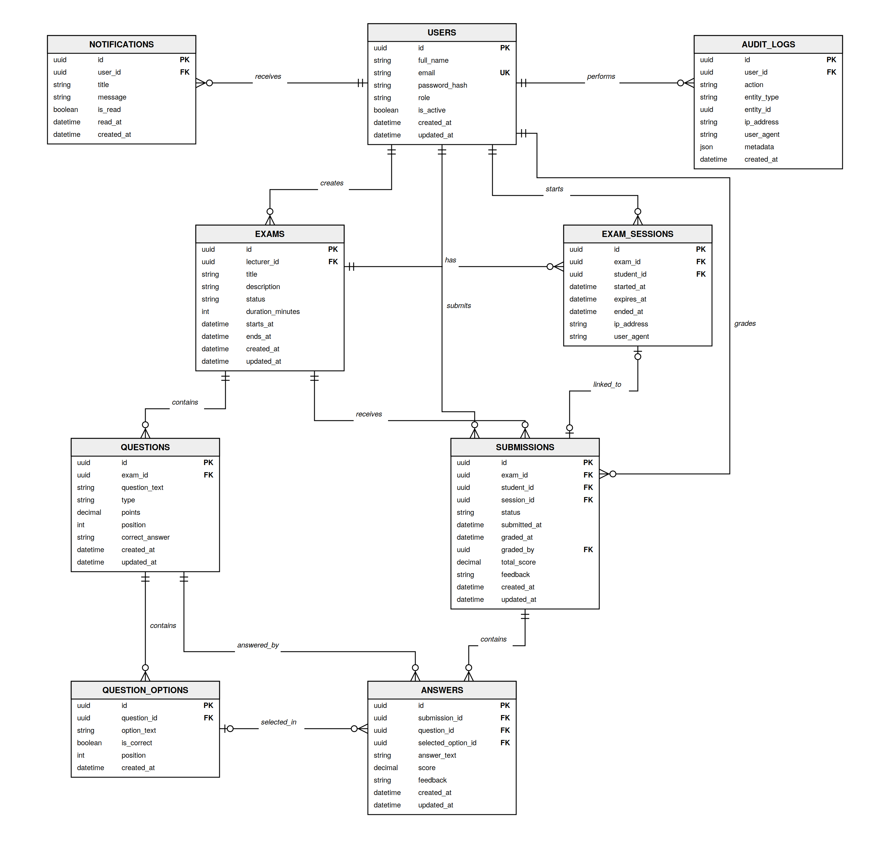

# Database Design and ERD

## Project Team

- Ameer Mresat
- Mohamed Kharanba

## 1. Database Overview

The Full Stack Exam Management System uses PostgreSQL as its persistent relational database.

The database stores:

- User accounts and roles.
- Exams.
- Questions.
- Question options.
- Student exam sessions.
- Exam submissions.
- Student answers.
- Grades and feedback.
- Notifications.
- Audit-log records.

The React frontend never accesses PostgreSQL directly.

All database operations are performed through the Node.js and Express backend using the PostgreSQL `pg` package.

---

## 2. Database Technology

| Technology | Purpose |
| --- | --- |
| PostgreSQL 16 | Relational database-management system |
| `pgcrypto` | UUID generation support |
| `pg` | Node.js PostgreSQL client |
| SQL schema | Defines tables, constraints, indexes, enums, and triggers |
| SQL seed | Creates initial demonstration data |
| Connection pool | Reuses database connections efficiently |

The database files are located under:

```text
database/
├── schema.sql
└── seed.sql
```

---

## 3. Database Initialization

The backend provides database initialization commands.

From the backend directory:

```bash
npm run db:init
npm run db:seed
```

### `db:init`

Creates:

- PostgreSQL extensions.
- Enum types.
- Tables.
- Primary keys.
- Foreign keys.
- Unique constraints.
- Check constraints.
- Indexes.
- Timestamp triggers.

### `db:seed`

Creates demonstration users and project data for local development and testing.

The production database should not use unsafe demonstration passwords.

---

## 4. Database Enumerations

PostgreSQL enum types restrict fields to a defined set of values.

### User Role

```text
ADMIN
LECTURER
STUDENT
```

### Exam Status

```text
DRAFT
PUBLISHED
CLOSED
RESULTS_PUBLISHED
```

### Question Type

```text
MULTIPLE_CHOICE
TRUE_FALSE
SHORT_ANSWER
ESSAY
CODE
```

### Submission Status

```text
IN_PROGRESS
SUBMITTED
GRADED
```

Enums prevent invalid values from being stored in the database.

---

## 5. Database Tables

The schema contains the following main tables:

| Table | Main Responsibility |
| --- | --- |
| `users` | User accounts, authentication information, and roles |
| `exams` | Exam definitions, schedules, owners, and statuses |
| `questions` | Questions belonging to exams |
| `question_options` | Selectable options belonging to questions |
| `exam_sessions` | Timed student exam sessions |
| `submissions` | Overall student attempts and grades |
| `answers` | Individual student answers, scores, and feedback |
| `notifications` | User notification messages |
| `audit_logs` | Activity and security records |

---

## 6. Users Table

The `users` table stores application accounts.

### Main Fields

| Field | Purpose |
| --- | --- |
| `id` | Primary key and user UUID |
| `full_name` | User's displayed full name |
| `email` | Unique login email |
| `password_hash` | bcrypt password hash |
| `role` | `ADMIN`, `LECTURER`, or `STUDENT` |
| `is_active` | Indicates whether the account is active |
| `created_at` | Account-creation timestamp |
| `updated_at` | Last-update timestamp |

### Keys

```text
Primary Key:
users.id

Unique Key:
users.email
```

### Security Rule

The database stores only `password_hash`.

It never stores a plain-text password.

The password hash must not be returned to the React frontend.

---

## 7. Exams Table

The `exams` table stores exams created by lecturers.

### Main Fields

| Field | Purpose |
| --- | --- |
| `id` | Primary key and exam UUID |
| `lecturer_id` | Foreign key referencing the exam owner |
| `title` | Exam title |
| `description` | Exam description |
| `status` | Current exam status |
| `duration_minutes` | Exam duration |
| `starts_at` | Scheduled start time |
| `ends_at` | Scheduled closing time |
| `created_at` | Creation timestamp |
| `updated_at` | Last-update timestamp |

### Keys

```text
Primary Key:
exams.id

Foreign Key:
exams.lecturer_id → users.id
```

### Relationship

One lecturer can create many exams.

```text
USERS 1 ─────── N EXAMS
```

### Business Rules

- The exam owner must be a lecturer or authorized administrator.
- The duration must be positive.
- The ending time must be after the starting time.
- A newly created exam normally begins with `DRAFT` status.
- Students can access an exam only after it is published and available.

---

## 8. Questions Table

The `questions` table stores questions belonging to exams.

### Main Fields

| Field | Purpose |
| --- | --- |
| `id` | Primary key and question UUID |
| `exam_id` | Foreign key referencing the exam |
| `question_text` | Question content |
| `type` | Question type |
| `points` | Maximum question score |
| `position` | Question order inside the exam |
| `correct_answer` | Correct answer for applicable question types |
| `created_at` | Creation timestamp |
| `updated_at` | Last-update timestamp |

### Keys

```text
Primary Key:
questions.id

Foreign Key:
questions.exam_id → exams.id
```

### Relationship

One exam can contain many questions.

```text
EXAMS 1 ─────── N QUESTIONS
```

### Important Constraint

A question position should be unique inside its exam.

Logical unique constraint:

```text
UNIQUE (exam_id, position)
```

This prevents two questions in the same exam from using the same position.

### Security Rule

The `correct_answer` value must not be returned to students during an active exam.

---

## 9. Question Options Table

The `question_options` table stores selectable answer options.

It is mainly used by:

- Multiple-choice questions.
- True-or-false questions.

### Main Fields

| Field | Purpose |
| --- | --- |
| `id` | Primary key and option UUID |
| `question_id` | Foreign key referencing the question |
| `option_text` | Text displayed to the student |
| `is_correct` | Indicates whether the option is correct |
| `position` | Option order |
| `created_at` | Creation timestamp |

### Keys

```text
Primary Key:
question_options.id

Foreign Key:
question_options.question_id → questions.id
```

### Relationship

One question can contain many answer options.

```text
QUESTIONS 1 ─────── N QUESTION_OPTIONS
```

### Security Rule

The `is_correct` field must not be returned to students while they are taking an exam.

---

## 10. Exam Sessions Table

The `exam_sessions` table stores timed exam participation.

A session is created when a student starts an exam.

### Main Fields

| Field | Purpose |
| --- | --- |
| `id` | Primary key and session UUID |
| `exam_id` | Foreign key referencing the exam |
| `student_id` | Foreign key referencing the student |
| `started_at` | Session starting time |
| `expires_at` | Calculated expiration time |
| `ended_at` | Session-ending time |
| `ip_address` | Optional client IP information |
| `user_agent` | Optional browser or client information |

### Keys

```text
Primary Key:
exam_sessions.id

Foreign Keys:
exam_sessions.exam_id → exams.id
exam_sessions.student_id → users.id
```

### Relationships

```text
USERS 1 ─────── N EXAM_SESSIONS
EXAMS 1 ─────── N EXAM_SESSIONS
```

### Important Constraint

A student should have only one exam session for the same exam.

Logical unique constraint:

```text
UNIQUE (exam_id, student_id)
```

### Time Rules

- `expires_at` must be after `started_at`.
- `ended_at` cannot be before `started_at`.
- The backend calculates expiration according to the exam duration.

---

## 11. Submissions Table

The `submissions` table represents an overall student exam attempt.

### Main Fields

| Field | Purpose |
| --- | --- |
| `id` | Primary key and submission UUID |
| `exam_id` | Foreign key referencing the exam |
| `student_id` | Foreign key referencing the student |
| `session_id` | Foreign key referencing the exam session |
| `status` | Current submission status |
| `submitted_at` | Submission timestamp |
| `graded_at` | Grading timestamp |
| `graded_by` | Lecturer or administrator who graded it |
| `total_score` | Final submission score |
| `feedback` | General lecturer feedback |
| `created_at` | Creation timestamp |
| `updated_at` | Last-update timestamp |

### Keys

```text
Primary Key:
submissions.id

Foreign Keys:
submissions.exam_id → exams.id
submissions.student_id → users.id
submissions.session_id → exam_sessions.id
submissions.graded_by → users.id
```

### Relationships

```text
USERS 1 ─────── N SUBMISSIONS
EXAMS 1 ─────── N SUBMISSIONS
EXAM_SESSIONS 1 ─────── 0..1 SUBMISSION
```

### Important Constraint

A student should have only one submission for the same exam.

Logical unique constraint:

```text
UNIQUE (exam_id, student_id)
```

### Submission Lifecycle

```text
IN_PROGRESS
      |
      v
SUBMITTED
      |
      v
GRADED
```

### Score Rule

The total score cannot be negative.

---

## 12. Answers Table

The `answers` table stores each answer inside a submission.

### Main Fields

| Field | Purpose |
| --- | --- |
| `id` | Primary key and answer UUID |
| `submission_id` | Foreign key referencing the submission |
| `question_id` | Foreign key referencing the question |
| `selected_option_id` | Selected option for choice questions |
| `answer_text` | Written answer for text-based questions |
| `score` | Lecturer-assigned answer score |
| `feedback` | Lecturer feedback for the answer |
| `created_at` | Creation timestamp |
| `updated_at` | Last-update timestamp |

### Keys

```text
Primary Key:
answers.id

Foreign Keys:
answers.submission_id → submissions.id
answers.question_id → questions.id
answers.selected_option_id → question_options.id
```

### Relationships

```text
SUBMISSIONS 1 ─────── N ANSWERS
QUESTIONS 1 ─────── N ANSWERS
QUESTION_OPTIONS 1 ─────── N ANSWERS
```

### Important Constraint

One submission should contain only one answer for each question.

Logical unique constraint:

```text
UNIQUE (submission_id, question_id)
```

### Answer Storage

For selectable questions:

```text
selected_option_id = selected option
answer_text = NULL
```

For written questions:

```text
selected_option_id = NULL
answer_text = student's text
```

### Score Rule

The answer score cannot be negative.

The backend should also prevent a score from exceeding the question's maximum points.

---

## 13. Notifications Table

The `notifications` table provides a foundation for user notifications.

### Main Fields

| Field | Purpose |
| --- | --- |
| `id` | Primary key and notification UUID |
| `user_id` | Foreign key referencing the receiving user |
| `title` | Notification title |
| `message` | Notification content |
| `is_read` | Read status |
| `read_at` | Timestamp when the message was read |
| `created_at` | Creation timestamp |

### Keys

```text
Primary Key:
notifications.id

Foreign Key:
notifications.user_id → users.id
```

### Relationship

One user can receive many notifications.

```text
USERS 1 ─────── N NOTIFICATIONS
```

The database table exists, but a complete notification interface is not yet implemented.

---

## 14. Audit Logs Table

The `audit_logs` table stores activity and security information.

### Main Fields

| Field | Purpose |
| --- | --- |
| `id` | Primary key and audit UUID |
| `user_id` | Optional foreign key referencing the user |
| `action` | Performed action |
| `entity_type` | Type of affected entity |
| `entity_id` | Identifier of the affected entity |
| `ip_address` | Client IP information |
| `user_agent` | Browser or client information |
| `metadata` | Additional JSONB information |
| `created_at` | Event timestamp |

### Keys

```text
Primary Key:
audit_logs.id

Foreign Key:
audit_logs.user_id → users.id
```

### Relationship

One user can generate many audit-log records.

```text
USERS 1 ─────── N AUDIT_LOGS
```

The `metadata` field uses JSONB so different audit events can store different additional information.

A complete audit-log management interface is not yet implemented.

---

## 15. Relationship Summary

| Parent Table | Child Table | Relationship |
| --- | --- | --- |
| `users` | `exams` | One lecturer creates many exams |
| `users` | `exam_sessions` | One student starts many sessions |
| `users` | `submissions` | One student creates many submissions |
| `users` | `submissions` | One lecturer can grade many submissions |
| `users` | `notifications` | One user receives many notifications |
| `users` | `audit_logs` | One user generates many audit records |
| `exams` | `questions` | One exam contains many questions |
| `exams` | `exam_sessions` | One exam has many sessions |
| `exams` | `submissions` | One exam receives many submissions |
| `questions` | `question_options` | One question contains many options |
| `questions` | `answers` | One question can have many student answers |
| `submissions` | `answers` | One submission contains many answers |
| `question_options` | `answers` | One option may be selected in many answers |

---

## 16. Primary Keys

Every main table uses a UUID primary key.

```text
users.id
exams.id
questions.id
question_options.id
exam_sessions.id
submissions.id
answers.id
notifications.id
audit_logs.id
```

UUIDs are useful because:

- They are difficult to predict.
- They can be generated independently.
- They reduce conflicts between distributed systems.
- They are suitable for public API identifiers.

---

## 17. Foreign Keys

Foreign keys preserve referential integrity.

Examples:

```text
exams.lecturer_id → users.id
questions.exam_id → exams.id
question_options.question_id → questions.id
exam_sessions.exam_id → exams.id
exam_sessions.student_id → users.id
submissions.exam_id → exams.id
submissions.student_id → users.id
submissions.session_id → exam_sessions.id
submissions.graded_by → users.id
answers.submission_id → submissions.id
answers.question_id → questions.id
answers.selected_option_id → question_options.id
notifications.user_id → users.id
audit_logs.user_id → users.id
```

A foreign key prevents a child record from referencing a parent record that does not exist.

---

## 18. Unique Constraints

Important logical unique constraints include:

```text
users.email
questions (exam_id, position)
exam_sessions (exam_id, student_id)
submissions (exam_id, student_id)
answers (submission_id, question_id)
```

These constraints prevent:

- Duplicate user email addresses.
- Duplicate question positions inside one exam.
- Duplicate sessions for the same student and exam.
- Duplicate submissions for the same student and exam.
- Duplicate answers for the same question and submission.

---

## 19. Check Constraints

Check constraints protect the database from invalid values.

Examples include:

- Positive exam duration.
- Non-negative question points.
- Non-negative answer scores.
- Non-negative total scores.
- Exam end time after exam start time.
- Session expiration after session start time.
- Session end time not before session start time.

Backend validation improves the API response, but database constraints remain the final data-integrity protection.

---

## 20. Indexes

Indexes improve frequently used database queries.

Useful indexed fields include:

- User email.
- User role.
- Exam lecturer ID.
- Exam status.
- Exam start time.
- Question exam ID.
- Submission student ID.
- Submission exam ID.
- Submission status.
- Notification user ID.
- Audit-log action.
- Audit-log entity type.

Indexes improve reading speed but also require storage and add work during insert and update operations.

---

## 21. Timestamp Trigger

Tables that contain an `updated_at` field use an update trigger.

The trigger automatically changes `updated_at` whenever the row is updated.

Logical flow:

```text
UPDATE row
    |
    v
set_updated_at trigger
    |
    v
updated_at = current timestamp
```

This prevents application code from forgetting to update modification timestamps.

---

## 22. Database Transactions

Transactions are used when several database operations must succeed together.

Example: creating a question with its options.

```text
BEGIN
    |
    +-- Insert question
    |
    +-- Insert option 1
    |
    +-- Insert option 2
    |
    +-- Insert option 3
    |
    v
COMMIT
```

If any operation fails:

```text
ROLLBACK
```

This prevents a question from being created with only part of its options.

Transactions are also useful for:

- Starting an exam session and creating its submission.
- Auto-saving multiple answers.
- Submitting an exam.
- Updating related grading information.

---

## 23. Main Database Data Flow

### Lecturer Creates an Exam

```text
Lecturer
    |
    v
React Create Exam Form
    |
    v
Express Exam Controller
    |
    v
Exam Service
    |
    v
INSERT INTO exams
    |
    v
PostgreSQL
```

### Student Starts an Exam

```text
Student
    |
    v
Student Exam Service
    |
    +-- INSERT INTO exam_sessions
    |
    +-- INSERT INTO submissions
    |
    v
Submission status = IN_PROGRESS
```

### Student Saves an Answer

```text
Student Answer
    |
    v
Auto-Save API
    |
    v
INSERT or UPDATE answers
    |
    v
PostgreSQL
```

### Lecturer Grades a Submission

```text
Lecturer
    |
    +-- UPDATE answers.score
    |
    +-- UPDATE answers.feedback
    |
    +-- UPDATE submissions.total_score
    |
    +-- UPDATE submissions.feedback
    |
    v
Submission status = GRADED
```

---

## 24. Data Ownership

### Lecturer Ownership

A lecturer may manage only exams that the lecturer owns.

The backend verifies:

```text
exams.lecturer_id = authenticated user ID
```

### Student Ownership

A student may access only the student's own:

- Exam sessions.
- Submissions.
- Answers.
- Results.

The backend verifies:

```text
submissions.student_id = authenticated user ID
```

### Grading Ownership

A lecturer may grade a submission only when the related exam belongs to the lecturer.

Administrators may be authorized for platform-level operations.

---

## 25. Database Security

The database design follows these security rules:

- Plain-text passwords are never stored.
- Password hashes are not returned to the frontend.
- Database credentials are loaded from environment variables.
- Real credentials are excluded from Git.
- Kubernetes Secrets store sensitive deployment values.
- Student queries do not return correct-answer fields.
- Foreign keys preserve referential integrity.
- Role and ownership checks are applied by the backend.
- Production database traffic should use encrypted connections.
- Production credentials should use a managed secret service.

The local database connection is configured using:

```text
DATABASE_URL
```

---

## 26. Normalization

The database follows normalized relational-design principles.

### Separate Entities

Each main concept has its own table:

- Users.
- Exams.
- Questions.
- Options.
- Sessions.
- Submissions.
- Answers.

### Reduced Duplication

Question options are not stored repeatedly inside the question row.

Student answers are not stored directly inside the submission row.

Exam data is not duplicated in each submission.

### Relationship Tables

Foreign keys connect related information.

This reduces duplication and makes updates safer.

---

## 27. Database ERD

The editable ERD source is located at:

```text
docs/diagrams/database-erd.mmd
```

The rendered ERD is:



The ERD shows:

- All main database tables.
- Primary keys.
- Foreign keys.
- One-to-many relationships.
- Optional relationships.
- Main table attributes.

---

## 28. Current Database Limitations

The following database-related items are not yet fully production-ready:

- Managed Google Cloud PostgreSQL deployment.
- Automatic database migrations.
- Automated database backup policy.
- Point-in-time recovery.
- Production high availability.
- Complete notification delivery.
- Complete audit-log interface.
- Data-retention policy.
- Automated integration tests.
- Production monitoring and alerting.