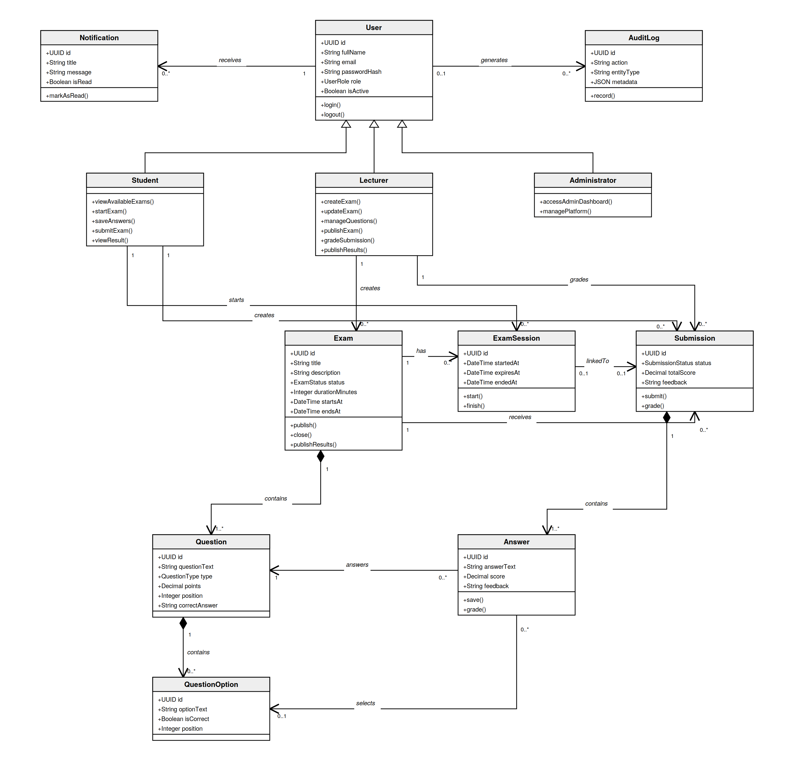

# OOP and Domain UML

## Project Team

- Ameer Mresat
- Mohamed Kharanba

## 1. Overview

The OOP UML diagram describes the main logical objects of the Full Stack Exam Management System and the relationships between them.

The backend is implemented mainly with JavaScript functions, controllers, services, and PostgreSQL queries.

It does not use traditional JavaScript class instances for every database entity.

Therefore, this UML class diagram represents the system's logical domain model rather than an exact one-to-one implementation of JavaScript classes.

The diagram helps explain:

- The main domain entities.
- Their attributes.
- Their responsibilities.
- Inheritance between user roles.
- Associations between objects.
- Composition relationships.
- Multiplicity and cardinality.

---

## 2. Main Domain Classes

The domain model includes:

- `User`
- `Student`
- `Lecturer`
- `Administrator`
- `Exam`
- `Question`
- `QuestionOption`
- `ExamSession`
- `Submission`
- `Answer`
- `Notification`
- `AuditLog`

---

## 3. User Class

The `User` class represents common information shared by every system user.

### Main Attributes

| Attribute | Type | Description |
| --- | --- | --- |
| `id` | UUID | Unique user identifier |
| `fullName` | String | User's full name |
| `email` | String | Unique login email |
| `passwordHash` | String | bcrypt password hash |
| `role` | UserRole | User role |
| `isActive` | Boolean | Account status |

### Main Operations

```text
login()
logout()
```

### Security Responsibility

The user domain object must not expose:

- Plain-text passwords.
- Password hashes to the frontend.
- JWT secrets.
- Database credentials.

---

## 4. User Inheritance

The domain model contains three user specializations:

```text
User
├── Student
├── Lecturer
└── Administrator
```

This represents an inheritance relationship.

All three roles share the common `User` attributes, but each role has different responsibilities.

---

## 5. Student Class

The `Student` class represents a user who participates in exams.

### Inherited Attributes

The student inherits:

- `id`
- `fullName`
- `email`
- `passwordHash`
- `role`
- `isActive`

### Main Operations

```text
viewAvailableExams()
startExam()
saveAnswers()
submitExam()
viewSubmissions()
viewResult()
```

### Responsibilities

A student can:

- View published and available exams.
- Start an exam session.
- Receive student-safe questions.
- Save answers.
- Submit an exam.
- View previous submissions.
- View published grades and feedback.

### Restrictions

A student cannot:

- Create exams.
- Edit exam questions.
- Grade submissions.
- View another student's submission.
- View correct answers during an active exam.

---

## 6. Lecturer Class

The `Lecturer` class represents a user who creates and manages exams.

### Main Operations

```text
createExam()
updateExam()
deleteExam()
manageQuestions()
publishExam()
closeExam()
gradeSubmission()
publishResults()
```

### Responsibilities

A lecturer can:

- Create exams.
- Update owned exams.
- Delete owned exams.
- Add and manage questions.
- Publish exams.
- Close exams.
- Review submissions.
- Grade answers.
- Grade complete submissions.
- Add feedback.
- Publish results.

### Ownership Rule

A lecturer may manage only authorized exams.

Logical ownership condition:

```text
exam.lecturerId = authenticatedLecturer.id
```

---

## 7. Administrator Class

The `Administrator` class represents a platform-level user.

### Main Operations

```text
accessAdminDashboard()
managePlatform()
```

### Current Implementation

The current project includes:

- Administrator role support.
- Administrator authentication.
- Administrator authorization.
- Protected administrator dashboard.
- Administrator access to lecturer-level backend operations.

### Current Limitation

Complete administrator functionality is not yet implemented.

Future administrator operations may include:

```text
manageUsers()
manageRoles()
viewAuditLogs()
manageNotifications()
manageSystemSettings()
```

---

## 8. Exam Class

The `Exam` class represents one examination.

### Main Attributes

| Attribute | Type | Description |
| --- | --- | --- |
| `id` | UUID | Unique exam identifier |
| `lecturerId` | UUID | Exam owner |
| `title` | String | Exam title |
| `description` | String | Exam description |
| `status` | ExamStatus | Current status |
| `durationMinutes` | Integer | Exam duration |
| `startsAt` | DateTime | Start time |
| `endsAt` | DateTime | Closing time |

### Main Operations

```text
publish()
close()
publishResults()
```

### Exam Status Values

```text
DRAFT
PUBLISHED
CLOSED
RESULTS_PUBLISHED
```

### Relationships

One lecturer may create many exams.

```text
Lecturer 1 ─────── 0..* Exam
```

One exam contains one or more questions.

```text
Exam 1 ◆────── 1..* Question
```

The filled diamond represents composition.

If an exam is removed, its questions logically belong only to that exam.

---

## 9. Question Class

The `Question` class represents one question inside an exam.

### Main Attributes

| Attribute | Type | Description |
| --- | --- | --- |
| `id` | UUID | Question identifier |
| `examId` | UUID | Parent exam |
| `questionText` | String | Question content |
| `type` | QuestionType | Question type |
| `points` | Decimal | Maximum points |
| `position` | Integer | Order inside the exam |
| `correctAnswer` | String | Correct answer when applicable |

### Question Types

```text
MULTIPLE_CHOICE
TRUE_FALSE
SHORT_ANSWER
ESSAY
CODE
```

### Relationships

One exam contains many questions:

```text
Exam 1 ◆────── 1..* Question
```

One question may contain zero or more options:

```text
Question 1 ◆────── 0..* QuestionOption
```

### Security Responsibility

The student-facing model must not expose:

```text
correctAnswer
```

---

## 10. QuestionOption Class

The `QuestionOption` class represents a selectable answer option.

### Main Attributes

| Attribute | Type | Description |
| --- | --- | --- |
| `id` | UUID | Option identifier |
| `questionId` | UUID | Parent question |
| `optionText` | String | Displayed option text |
| `isCorrect` | Boolean | Correct-option indicator |
| `position` | Integer | Option order |

### Relationship

A question owns its options.

```text
Question 1 ◆────── 0..* QuestionOption
```

### Security Responsibility

The student-facing response must not expose:

```text
isCorrect
```

while the exam is active.

---

## 11. ExamSession Class

The `ExamSession` class represents a student's timed exam session.

### Main Attributes

| Attribute | Type | Description |
| --- | --- | --- |
| `id` | UUID | Session identifier |
| `examId` | UUID | Related exam |
| `studentId` | UUID | Participating student |
| `startedAt` | DateTime | Start time |
| `expiresAt` | DateTime | Expiration time |
| `endedAt` | DateTime | End time |
| `ipAddress` | String | Optional client IP |
| `userAgent` | String | Optional client information |

### Main Operations

```text
start()
finish()
isExpired()
```

### Relationships

One student may start many exam sessions:

```text
Student 1 ─────── 0..* ExamSession
```

One exam may have many student sessions:

```text
Exam 1 ─────── 0..* ExamSession
```

One exam session may be connected to one submission:

```text
ExamSession 0..1 ─────── 0..1 Submission
```

---

## 12. Submission Class

The `Submission` class represents the student's complete exam attempt.

### Main Attributes

| Attribute | Type | Description |
| --- | --- | --- |
| `id` | UUID | Submission identifier |
| `examId` | UUID | Related exam |
| `studentId` | UUID | Submission owner |
| `sessionId` | UUID | Related session |
| `status` | SubmissionStatus | Submission status |
| `submittedAt` | DateTime | Submission time |
| `gradedAt` | DateTime | Grading time |
| `gradedBy` | UUID | Grader identifier |
| `totalScore` | Decimal | Final score |
| `feedback` | String | General feedback |

### Submission Status Values

```text
IN_PROGRESS
SUBMITTED
GRADED
```

### Main Operations

```text
submit()
grade()
calculateTotalScore()
```

### Relationships

One student may create many submissions:

```text
Student 1 ─────── 0..* Submission
```

One exam may receive many submissions:

```text
Exam 1 ─────── 0..* Submission
```

One submission contains one or more answers:

```text
Submission 1 ◆────── 1..* Answer
```

One lecturer may grade many submissions:

```text
Lecturer 1 ─────── 0..* Submission
```

---

## 13. Answer Class

The `Answer` class represents one student's answer to one question.

### Main Attributes

| Attribute | Type | Description |
| --- | --- | --- |
| `id` | UUID | Answer identifier |
| `submissionId` | UUID | Parent submission |
| `questionId` | UUID | Answered question |
| `selectedOptionId` | UUID | Selected option when applicable |
| `answerText` | String | Written answer when applicable |
| `score` | Decimal | Awarded score |
| `feedback` | String | Lecturer feedback |

### Main Operations

```text
save()
update()
grade()
```

### Relationships

A submission contains many answers:

```text
Submission 1 ◆────── 1..* Answer
```

Each answer references one question:

```text
Answer 0..* ─────── 1 Question
```

An answer may select one option:

```text
Answer 0..* ─────── 0..1 QuestionOption
```

### Answer Variants

For a selectable question:

```text
selectedOptionId = selected option
answerText = null
```

For a written question:

```text
selectedOptionId = null
answerText = written response
```

---

## 14. Notification Class

The `Notification` class represents a message delivered to a user.

### Main Attributes

| Attribute | Type | Description |
| --- | --- | --- |
| `id` | UUID | Notification identifier |
| `userId` | UUID | Receiving user |
| `title` | String | Notification title |
| `message` | String | Notification content |
| `isRead` | Boolean | Read status |
| `readAt` | DateTime | Read timestamp |

### Main Operations

```text
markAsRead()
```

### Relationship

One user may receive many notifications:

```text
User 1 ─────── 0..* Notification
```

The database foundation exists, but the complete notification interface is not yet implemented.

---

## 15. AuditLog Class

The `AuditLog` class represents an activity or security event.

### Main Attributes

| Attribute | Type | Description |
| --- | --- | --- |
| `id` | UUID | Audit record identifier |
| `userId` | UUID | Related user |
| `action` | String | Performed action |
| `entityType` | String | Affected object type |
| `entityId` | UUID | Affected object identifier |
| `ipAddress` | String | Optional client IP |
| `userAgent` | String | Optional client information |
| `metadata` | JSON | Additional event information |
| `createdAt` | DateTime | Event time |

### Main Operation

```text
record()
```

### Relationship

One user may generate many audit-log records:

```text
User 0..1 ─────── 0..* AuditLog
```

The user side may be optional because some system events may occur without an authenticated user.

---

## 16. Relationship Types

### Inheritance

```text
User <|-- Student
User <|-- Lecturer
User <|-- Administrator
```

Inheritance means that the child roles reuse the common user properties.

### Association

Example:

```text
Lecturer ─────── Exam
```

An association means two objects are related.

### Composition

Example:

```text
Exam ◆────── Question
Submission ◆────── Answer
```

Composition represents a strong ownership relationship.

A question belongs to one exam.

An answer belongs to one submission.

### Multiplicity

Examples:

```text
1
0..1
0..*
1..*
```

Meaning:

| Multiplicity | Meaning |
| --- | --- |
| `1` | Exactly one |
| `0..1` | Zero or one |
| `0..*` | Zero or many |
| `1..*` | One or many |

---

## 17. Main Relationship Summary

| Source Class | Relationship | Target Class |
| --- | --- | --- |
| `User` | Parent class | `Student` |
| `User` | Parent class | `Lecturer` |
| `User` | Parent class | `Administrator` |
| `Lecturer` | Creates | `Exam` |
| `Exam` | Contains | `Question` |
| `Question` | Contains | `QuestionOption` |
| `Student` | Starts | `ExamSession` |
| `Exam` | Has | `ExamSession` |
| `Student` | Creates | `Submission` |
| `Exam` | Receives | `Submission` |
| `ExamSession` | Links to | `Submission` |
| `Submission` | Contains | `Answer` |
| `Answer` | Answers | `Question` |
| `Answer` | Selects | `QuestionOption` |
| `Lecturer` | Grades | `Submission` |
| `User` | Receives | `Notification` |
| `User` | Generates | `AuditLog` |

---

## 18. Logical OOP Flow

Although the backend uses service functions, the logical object interaction can be described as:

```text
Student
    |
    v
ExamSession.start()
    |
    v
Submission created
    |
    v
Answer.save()
    |
    v
Submission.submit()
    |
    v
Lecturer.gradeSubmission()
    |
    v
Exam.publishResults()
    |
    v
Student.viewResult()
```

Lecturer flow:

```text
Lecturer.createExam()
    |
    v
Exam created
    |
    v
Exam.addQuestion()
    |
    v
Question.addOption()
    |
    v
Exam.publish()
```

---

## 19. UML and Backend Implementation Mapping

| UML Concept | Current Backend Implementation |
| --- | --- |
| `User` | `users` table and authentication service |
| `Student` | User with `STUDENT` role |
| `Lecturer` | User with `LECTURER` role |
| `Administrator` | User with `ADMIN` role |
| `Exam` | `exams` table and exam service |
| `Question` | `questions` table and question service |
| `QuestionOption` | `question_options` table |
| `ExamSession` | `exam_sessions` table and student exam service |
| `Submission` | `submissions` table and grading service |
| `Answer` | `answers` table |
| `Notification` | `notifications` table |
| `AuditLog` | `audit_logs` table |

The UML methods represent logical operations implemented by controllers and service functions.

For example:

```text
Exam.publish()
```

is implemented through:

```text
PATCH /api/exams/:id/publish
→ Exam Controller
→ Exam Service
→ PostgreSQL UPDATE
```

---

## 20. OOP Principles Represented

### Encapsulation

Each domain object groups related data and responsibilities.

Example:

```text
Submission
- status
- totalScore
- feedback
- submit()
- grade()
```

### Inheritance

Student, Lecturer, and Administrator inherit common user characteristics.

### Abstraction

The UML describes high-level domain operations without exposing SQL implementation details.

### Polymorphism

Different user roles interact with the same system using different permissions and operations.

For example:

```text
Student views exams.
Lecturer creates exams.
Administrator performs platform-level operations.
```

---

## 21. OOP Class Diagram

The editable diagram source is located at:

```text
docs/diagrams/oop-class-diagram.mmd
```

The rendered diagram is:



The diagram shows:

- User-role inheritance.
- Main entity attributes.
- Main logical operations.
- Exam and question composition.
- Submission and answer composition.
- Session relationships.
- Grading relationships.
- Notification and audit relationships.

---

## 22. Important Implementation Note

The UML diagram is a conceptual class diagram.

The current Node.js backend uses:

- Route functions.
- Controller functions.
- Validation schemas.
- Service functions.
- PostgreSQL query results.

It does not create one JavaScript class instance for every database row.

This is a valid architectural choice for an Express application.

The UML is used to explain the application's object-oriented domain structure and responsibilities.

---

## 23. Current OOP Model Limitations

The following logical classes or operations may be added in future versions:

- `NotificationService`
- `AuditService`
- `AnalyticsService`
- `MonitoringSession`
- `ExamAttemptPolicy`
- `AdminUserManager`
- `Report`
- `DashboardMetric`
- Real-time Socket.IO event objects
- AI grading or assistance objects