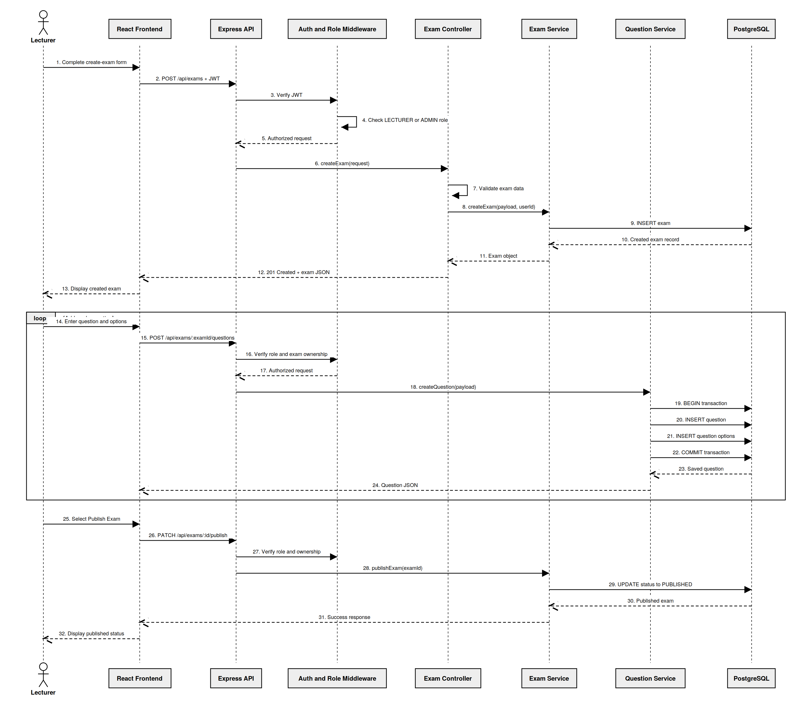
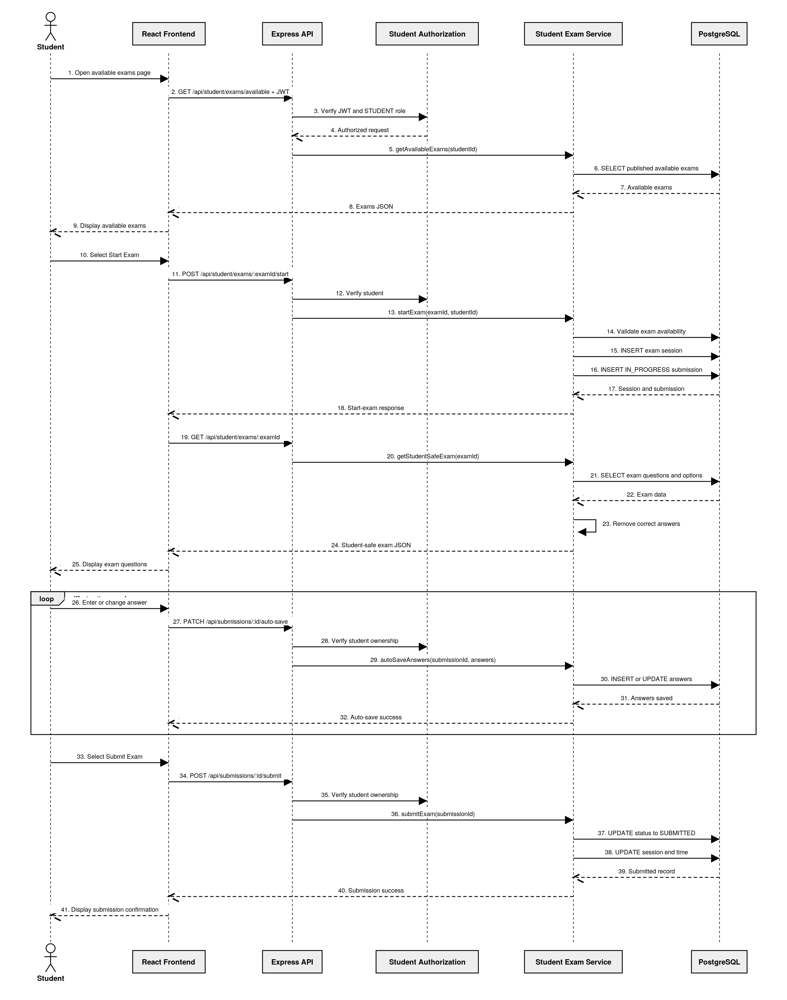
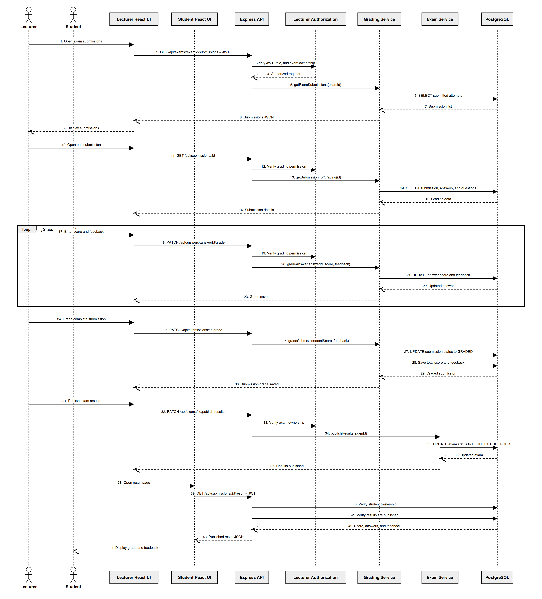

# Main System Sequence Diagrams

## Project Team

- Ameer Mresat
- Mohamed Kharanba

## 1. Overview

Sequence diagrams describe how users and system components communicate during an important application scenario.

Each diagram presents:

- The participating actor.
- The React frontend.
- The Express backend.
- Authentication and authorization.
- Controllers and services.
- PostgreSQL operations.
- Responses returned to the user.

The project contains three main scenarios:

1. Lecturer creates questions and publishes an exam.
2. Student starts, takes, auto-saves, and submits an exam.
3. Lecturer grades a submission and publishes results.

These scenarios represent the main end-to-end flows of the Exam Management System.

---

# Scenario 1 — Lecturer Creates and Publishes an Exam

## 2. Scenario Purpose

This scenario describes how a lecturer creates an exam, adds questions, and publishes the exam so students can access it.

The editable diagram source is located at:

```text
docs/diagrams/sequence-lecturer-exam.mmd
```

The rendered diagram is:



---

## 3. Scenario Participants

| Participant | Responsibility |
| --- | --- |
| Lecturer | Creates and publishes the exam |
| React Frontend | Displays forms and sends API requests |
| Express API | Receives and routes HTTP requests |
| Authentication Middleware | Verifies the JWT |
| Role Middleware | Verifies lecturer or administrator permissions |
| Exam Controller | Handles exam HTTP requests |
| Exam Service | Applies exam business rules |
| Question Service | Creates questions and options |
| PostgreSQL | Stores exams, questions, and options |

---

## 4. Preconditions

Before the scenario begins:

- The lecturer has a registered account.
- The lecturer is logged in.
- The frontend stores a valid JWT.
- The lecturer has the `LECTURER` role.
- The backend and PostgreSQL database are running.
- Axios is configured to send requests to the backend.

---

## 5. Step-by-Step Flow

### Step 1 — Lecturer Opens the Create-Exam Page

The lecturer navigates to:

```text
/lecturer/exams/create
```

React Router loads the `CreateExam` component.

`ProtectedRoute` verifies that the user:

- Is authenticated.
- Has the `LECTURER` role.

---

### Step 2 — Lecturer Enters Exam Information

The lecturer enters:

- Exam title.
- Description.
- Duration.
- Start date and time.
- End date and time.

React stores the values in component state.

---

### Step 3 — Frontend Sends the Create Request

The frontend sends:

```text
POST /api/exams
```

Example request:

```json
{
  "title": "Database Systems Final Exam",
  "description": "Final examination.",
  "durationMinutes": 90,
  "startsAt": "2026-08-01T09:00:00.000Z",
  "endsAt": "2026-08-01T12:00:00.000Z"
}
```

Axios attaches:

```text
Authorization: Bearer <JWT>
```

---

### Step 4 — Backend Authenticates the Lecturer

Authentication middleware:

1. Reads the Authorization header.
2. Extracts the JWT.
3. Verifies the token signature.
4. Reads the user ID and role.
5. Attaches the authenticated user to the request.

Role middleware verifies:

```text
LECTURER
ADMIN
```

If the user is not authorized, the request stops.

---

### Step 5 — Controller Validates the Request

The exam controller validates:

- Title.
- Duration.
- Start time.
- End time.
- Date order.
- Allowed values.

Invalid data produces a validation error before reaching PostgreSQL.

---

### Step 6 — Exam Service Creates the Exam

The controller calls the exam service.

The service:

1. Reads the authenticated lecturer ID.
2. Applies business rules.
3. Creates the exam with `DRAFT` status.
4. Sends an SQL insert query.

Logical query:

```text
INSERT INTO exams
(
  lecturer_id,
  title,
  description,
  status,
  duration_minutes,
  starts_at,
  ends_at
)
VALUES (...)
RETURNING *
```

---

### Step 7 — PostgreSQL Returns the Exam

PostgreSQL stores the new exam and returns its record.

The backend returns a JSON response to the frontend.

Example:

```json
{
  "success": true,
  "exam": {
    "id": "exam-uuid",
    "title": "Database Systems Final Exam",
    "status": "DRAFT"
  }
}
```

---

### Step 8 — Lecturer Opens Question Management

The lecturer navigates to:

```text
/lecturer/exams/:id/questions
```

The `ExamQuestions` component loads the exam questions.

---

### Step 9 — Lecturer Adds a Question

The lecturer enters:

- Question text.
- Question type.
- Points.
- Position.
- Correct answer.
- Options when required.

The frontend sends:

```text
POST /api/exams/:examId/questions
```

---

### Step 10 — Question Service Creates the Question

The backend verifies:

- JWT validity.
- Lecturer role.
- Exam ownership.
- Question validity.
- Option validity.

For a multiple-choice question, the question service may use a transaction:

```text
BEGIN
    |
    +-- INSERT question
    |
    +-- INSERT option 1
    |
    +-- INSERT option 2
    |
    +-- INSERT option 3
    |
    v
COMMIT
```

If an insert fails:

```text
ROLLBACK
```

This prevents incomplete question data.

---

### Step 11 — Lecturer Publishes the Exam

After adding the required questions, the lecturer selects Publish.

The frontend sends:

```text
PATCH /api/exams/:id/publish
```

The backend verifies:

- Lecturer identity.
- Lecturer role.
- Exam ownership.
- Current exam status.
- Required publication rules.

The exam service changes:

```text
DRAFT → PUBLISHED
```

---

### Step 12 — Frontend Displays the Published Status

The backend returns the updated exam.

React updates the lecturer page and displays:

```text
PUBLISHED
```

The exam can now appear in the student's available-exams page when its schedule permits access.

---

## 6. Main API Endpoints

| Method | Endpoint | Purpose |
| --- | --- | --- |
| `POST` | `/api/exams` | Create an exam |
| `GET` | `/api/exams/:id` | Return one exam |
| `POST` | `/api/exams/:examId/questions` | Add a question |
| `GET` | `/api/exams/:examId/questions` | Return questions |
| `PUT` | `/api/questions/:id` | Update a question |
| `DELETE` | `/api/questions/:id` | Delete a question |
| `PATCH` | `/api/exams/:id/publish` | Publish an exam |

---

## 7. Database Tables Used

```text
users
exams
questions
question_options
```

---

## 8. Security Checks

The backend verifies:

- Valid JWT.
- `LECTURER` or `ADMIN` role.
- Exam ownership.
- Valid exam data.
- Valid question data.
- Valid option structure.

The frontend alone is not trusted for authorization.

---

## 9. Alternative and Error Flows

### Invalid JWT

The backend returns an authentication error.

### Incorrect Role

A student cannot create or publish an exam.

### Invalid Exam Dates

The backend rejects an end date that is before the start date.

### Duplicate Question Position

PostgreSQL or the service rejects two questions with the same position in one exam.

### Unauthorized Exam Ownership

A lecturer cannot modify another lecturer's exam.

### Question Transaction Failure

The transaction rolls back, preventing partial option creation.

---

# Scenario 2 — Student Takes and Submits an Exam

## 10. Scenario Purpose

This scenario describes how a student views available exams, starts an exam, receives student-safe questions, auto-saves answers, and submits the exam.

The editable diagram source is located at:

```text
docs/diagrams/sequence-student-exam.mmd
```

The rendered diagram is:



---

## 11. Scenario Participants

| Participant | Responsibility |
| --- | --- |
| Student | Takes and submits the exam |
| React Frontend | Displays exams, questions, and answer controls |
| Express API | Receives student requests |
| Authentication Middleware | Verifies the JWT |
| Role Middleware | Verifies the `STUDENT` role |
| Student Exam Controller | Handles student exam requests |
| Student Exam Service | Handles sessions, answers, and submissions |
| PostgreSQL | Stores sessions, submissions, and answers |

---

## 12. Preconditions

Before the scenario begins:

- The student has an active account.
- The student is logged in.
- The JWT is valid.
- The student has the `STUDENT` role.
- The exam has `PUBLISHED` status.
- The current time is inside the exam availability window.
- The student has not already completed an attempt that prevents another start.

---

## 13. Step-by-Step Flow

### Step 1 — Student Loads Available Exams

The student opens:

```text
/student/exams
```

The frontend sends:

```text
GET /api/student/exams/available
```

Axios attaches the JWT.

---

### Step 2 — Backend Returns Available Exams

The backend verifies:

- JWT validity.
- Student role.
- Exam status.
- Exam start and end time.
- Student participation rules.

PostgreSQL returns exams that are available to the student.

React displays the exams.

---

### Step 3 — Student Starts an Exam

The student selects Start Exam.

The frontend sends:

```text
POST /api/student/exams/:examId/start
```

The backend verifies that:

- The exam exists.
- The exam is published.
- The exam is currently available.
- The authenticated user is a student.
- A conflicting session or submission does not already exist.

---

### Step 4 — Backend Creates the Exam Session

The student exam service creates an `exam_sessions` record.

The session contains:

- Exam ID.
- Student ID.
- Start time.
- Expiration time.
- Optional IP address.
- Optional user agent.

Logical calculation:

```text
expiresAt = startedAt + durationMinutes
```

---

### Step 5 — Backend Creates the Submission

The service creates a submission with:

```text
status = IN_PROGRESS
```

The submission is linked to:

- Student.
- Exam.
- Exam session.

The session and submission should be created consistently, potentially inside a database transaction.

---

### Step 6 — Frontend Loads the Exam

The frontend requests:

```text
GET /api/student/exams/:examId
```

The backend retrieves:

- Exam information.
- Questions.
- Question options.
- Session information.
- Submission information.

---

### Step 7 — Backend Creates a Student-Safe Response

Before returning the questions, the backend removes:

```text
correctAnswer
isCorrect
```

A student may receive:

- Question ID.
- Question text.
- Question type.
- Points.
- Position.
- Option ID.
- Option text.
- Option position.

The student does not receive which option is correct.

---

### Step 8 — Student Enters Answers

The `StudentTakeExam` page displays answer controls according to the question type.

Examples:

- Radio buttons for multiple choice.
- True-or-false controls.
- Text field for short answers.
- Text area for essays.
- Code input for code questions.

React stores the current answers in local component state.

---

### Step 9 — Frontend Auto-Saves Answers

During the exam, the frontend sends:

```text
PATCH /api/submissions/:submissionId/auto-save
```

Example:

```json
{
  "answers": [
    {
      "questionId": "question-uuid",
      "selectedOptionId": "option-uuid",
      "answerText": null
    }
  ]
}
```

The backend verifies:

- Valid JWT.
- Student role.
- Submission ownership.
- `IN_PROGRESS` status.
- Exam session validity.
- Question belongs to the exam.

---

### Step 10 — Backend Saves the Answers

The student exam service performs an insert or update operation.

Logical operation:

```text
INSERT answer
OR
UPDATE existing answer
```

A unique constraint prevents duplicate answers for the same question and submission:

```text
UNIQUE (submission_id, question_id)
```

The backend returns an auto-save confirmation.

---

### Step 11 — Student Submits the Exam

The student selects Submit Exam.

The frontend sends:

```text
POST /api/submissions/:submissionId/submit
```

The backend verifies ownership and submission status.

---

### Step 12 — Backend Finalizes the Submission

The service:

1. Saves any remaining answers.
2. Changes the submission status.
3. Sets the submission timestamp.
4. Sets the session ending time.
5. Prevents unauthorized future edits.

Status change:

```text
IN_PROGRESS → SUBMITTED
```

---

### Step 13 — Frontend Displays Confirmation

The backend returns a successful response.

React displays that the exam was submitted and may redirect the student to:

```text
/student/submissions
```

---

## 14. Main API Endpoints

| Method | Endpoint | Purpose |
| --- | --- | --- |
| `GET` | `/api/student/exams/available` | Return available exams |
| `POST` | `/api/student/exams/:examId/start` | Start an exam |
| `GET` | `/api/student/exams/:examId` | Return student-safe exam details |
| `PATCH` | `/api/submissions/:submissionId/auto-save` | Save answers |
| `POST` | `/api/submissions/:submissionId/submit` | Submit the exam |
| `GET` | `/api/submissions/my` | Return student submissions |

---

## 15. Database Tables Used

```text
users
exams
questions
question_options
exam_sessions
submissions
answers
```

---

## 16. Security Checks

The backend verifies:

- Valid JWT.
- `STUDENT` role.
- Student ownership.
- Exam availability.
- Session validity.
- Submission status.
- Question and exam relationship.
- Student-safe data filtering.

The student never controls the trusted student ID directly.

The student ID comes from the verified JWT.

---

## 17. Alternative and Error Flows

### Exam Not Published

The backend rejects the start request.

### Exam Not Yet Started

The backend returns an availability error.

### Exam Already Closed

The student cannot start the exam.

### Duplicate Session

The backend returns the existing session or rejects the duplicate request according to the service rules.

### Expired Session

The backend may reject further auto-save or submission operations.

### Submission Already Submitted

The backend prevents another final submission.

### Unauthorized Submission

A student cannot save or submit another student's submission.

### Invalid Question

The backend rejects answers for questions that do not belong to the selected exam.

---

# Scenario 3 — Lecturer Grades and Publishes Results

## 18. Scenario Purpose

This scenario describes how a lecturer reviews submissions, grades answers, grades the complete submission, publishes exam results, and allows the student to view the grade.

The editable diagram source is located at:

```text
docs/diagrams/sequence-grading.mmd
```

The rendered diagram is:



---

## 19. Scenario Participants

| Participant | Responsibility |
| --- | --- |
| Lecturer | Reviews and grades submissions |
| Student | Views the published result |
| Lecturer React UI | Displays grading controls |
| Student React UI | Displays grades and feedback |
| Express API | Receives grading and result requests |
| Authentication Middleware | Verifies JWTs |
| Role Middleware | Verifies lecturer or student roles |
| Grading Service | Updates answer and submission grades |
| Exam Service | Publishes exam results |
| PostgreSQL | Stores scores, feedback, and statuses |

---

## 20. Preconditions

Before grading begins:

- The lecturer is logged in.
- The lecturer owns the exam or has administrator permission.
- The student has submitted the exam.
- The submission has `SUBMITTED` status.
- The answers are stored in PostgreSQL.
- The results are not yet available to the student.

---

## 21. Step-by-Step Flow

### Step 1 — Lecturer Loads Exam Submissions

The lecturer opens:

```text
/lecturer/exams/:id/submissions
```

The frontend sends:

```text
GET /api/exams/:examId/submissions
```

The backend verifies:

- JWT validity.
- Lecturer or administrator role.
- Exam ownership.

---

### Step 2 — Backend Returns Submission List

The grading service queries PostgreSQL for submissions related to the exam.

The response may include:

- Submission ID.
- Student name.
- Student email.
- Submission status.
- Submission time.
- Total score.
- Grading time.

React displays the list.

---

### Step 3 — Lecturer Opens One Submission

The lecturer selects a submission.

The frontend navigates to:

```text
/lecturer/submissions/:id/grade
```

The frontend sends:

```text
GET /api/submissions/:id
```

---

### Step 4 — Backend Returns Grading Details

The backend verifies:

- Lecturer role.
- Exam ownership.
- Submission relationship to the exam.

PostgreSQL returns:

- Student information.
- Exam information.
- Questions.
- Correct answers.
- Student answers.
- Existing answer scores.
- Existing feedback.

Correct-answer information is allowed here because this is an authorized lecturer grading operation.

---

### Step 5 — Lecturer Grades an Answer

For a manually graded answer, the lecturer enters:

- Score.
- Feedback.

The frontend sends:

```text
PATCH /api/answers/:answerId/grade
```

Example request:

```json
{
  "score": 8,
  "feedback": "Good answer, but one explanation is missing."
}
```

---

### Step 6 — Backend Validates the Answer Grade

The backend verifies:

- Valid JWT.
- Lecturer or administrator role.
- Exam ownership.
- Answer belongs to the submission.
- Score is non-negative.
- Score does not exceed the maximum question points.

---

### Step 7 — Grading Service Updates the Answer

The grading service updates:

```text
answers.score
answers.feedback
answers.updated_at
```

PostgreSQL returns the updated answer.

The frontend displays the saved grade.

This process repeats for each manually graded answer.

---

### Step 8 — Lecturer Grades the Complete Submission

The lecturer enters:

- Total score.
- General feedback.

The frontend sends:

```text
PATCH /api/submissions/:id/grade
```

Example:

```json
{
  "totalScore": 82,
  "feedback": "Good overall work."
}
```

---

### Step 9 — Backend Finalizes the Grade

The grading service updates:

```text
submissions.total_score
submissions.feedback
submissions.graded_at
submissions.graded_by
submissions.status
```

Status change:

```text
SUBMITTED → GRADED
```

The backend returns the graded submission.

---

### Step 10 — Lecturer Publishes Results

After grading the required submissions, the lecturer selects Publish Results.

The frontend sends:

```text
PATCH /api/exams/:id/publish-results
```

The backend verifies:

- Lecturer identity.
- Exam ownership.
- Current exam status.
- Publication requirements.

---

### Step 11 — Exam Service Publishes Results

The exam service changes:

```text
CLOSED → RESULTS_PUBLISHED
```

PostgreSQL stores the new exam status.

After this change, students may retrieve published results.

---

### Step 12 — Student Opens the Result Page

The student opens:

```text
/student/results/:submissionId
```

The frontend sends:

```text
GET /api/submissions/:id/result
```

---

### Step 13 — Backend Verifies Student Access

The backend verifies:

- Valid student JWT.
- Student owns the submission.
- Submission is graded.
- Exam results are published.

If any condition fails, the result is not returned.

---

### Step 14 — Student Receives the Result

The backend returns:

- Exam title.
- Total score.
- Submission status.
- General feedback.
- Individual answer scores.
- Individual feedback.
- Submission time.
- Grading time.

React displays the result to the student.

---

## 22. Main API Endpoints

| Method | Endpoint | Purpose |
| --- | --- | --- |
| `GET` | `/api/exams/:examId/submissions` | Return exam submissions |
| `GET` | `/api/submissions/:id` | Return grading details |
| `PATCH` | `/api/answers/:answerId/grade` | Grade one answer |
| `PATCH` | `/api/submissions/:id/grade` | Grade the complete submission |
| `PATCH` | `/api/exams/:id/publish-results` | Publish exam results |
| `GET` | `/api/submissions/:id/result` | Return a published student result |

---

## 23. Database Tables Used

```text
users
exams
questions
question_options
submissions
answers
notifications
audit_logs
```

The current notification and audit-log tables provide a foundation, but complete automated usage is not yet implemented.

---

## 24. Security Checks

The backend verifies:

- Valid JWT.
- Correct role.
- Exam ownership.
- Submission relationship to the exam.
- Valid answer score.
- Valid total score.
- Student result ownership.
- `RESULTS_PUBLISHED` exam status.

A student cannot see a grade before results are published.

A lecturer cannot grade a submission belonging to another lecturer's exam unless administrator permission is granted.

---

## 25. Alternative and Error Flows

### Submission Not Submitted

The lecturer should not finalize grading for an active submission.

### Unauthorized Lecturer

The backend rejects grading attempts for an exam the lecturer does not own.

### Invalid Score

The backend rejects negative scores or scores above the question maximum.

### Results Not Published

The student cannot retrieve the result.

### Result Belongs to Another Student

The backend returns an authorization error.

### Submission Not Graded

The result endpoint does not return a final grade.

---

## 26. Status Transitions Across the Three Scenarios

### Exam Status

```text
DRAFT
   |
   v
PUBLISHED
   |
   v
CLOSED
   |
   v
RESULTS_PUBLISHED
```

### Submission Status

```text
IN_PROGRESS
      |
      v
SUBMITTED
      |
      v
GRADED
```

These transitions describe the main lifecycle of an exam and student submission.

---

## 27. Complete End-to-End Flow

```text
Lecturer Creates Exam
        |
        v
Lecturer Adds Questions
        |
        v
Lecturer Publishes Exam
        |
        v
Student Views Available Exam
        |
        v
Student Starts Exam
        |
        v
Backend Creates Session and Submission
        |
        v
Student Auto-Saves Answers
        |
        v
Student Submits Exam
        |
        v
Lecturer Reviews Submission
        |
        v
Lecturer Grades Answers
        |
        v
Lecturer Grades Submission
        |
        v
Lecturer Publishes Results
        |
        v
Student Views Grade and Feedback
```

---

## 28. Main Architecture Layers Used

All three scenarios pass through the same main architecture:

```text
User
    |
    v
React Page
    |
    v
Axios API Client
    |
    v
Express Route
    |
    v
Authentication Middleware
    |
    v
Role Authorization
    |
    v
Controller
    |
    v
Validator
    |
    v
Business Service
    |
    v
PostgreSQL
    |
    v
JSON Response
```

---

## 29. Sequence Diagram Files

| Scenario | Mermaid Source | Rendered PNG |
| --- | --- | --- |
| Lecturer creates and publishes an exam | `sequence-lecturer-exam.mmd` | `sequence-lecturer-exam.png` |
| Student takes and submits an exam | `sequence-student-exam.mmd` | `sequence-student-exam.png` |
| Lecturer grades and publishes results | `sequence-grading.mmd` | `sequence-grading.png` |

All files are located under:

```text
docs/diagrams/
```

---

## 30. Current Scenario Limitations

The sequence diagrams do not yet include:

- Real-time lecturer monitoring.
- Socket.IO events.
- Email notifications.
- Push notifications.
- Automatic grading for every question type.
- AI-assisted grading.
- Advanced cheating detection.
- Production cloud failures.
- Database-retry logic.
- Automatic deployment events.

These may be added in future project versions.