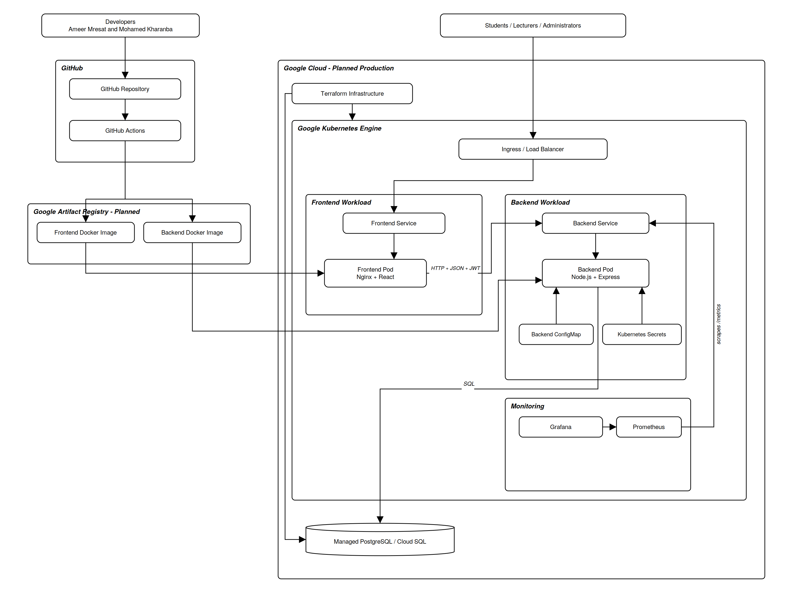

# DevOps and Deployment Architecture

## Project Team

- Ameer Mresat
- Mohamed Kharanba

## 1. Overview

The Full Stack Exam Management System includes a DevOps foundation for building, validating, containerizing, monitoring, and deploying the application.

The DevOps architecture includes:

- Git and GitHub.
- Git feature branches.
- GitHub Actions.
- Docker images.
- Nginx.
- Kubernetes.
- PostgreSQL persistent storage.
- Prometheus.
- Grafana.
- Terraform.
- Google Cloud infrastructure.
- Health and readiness checks.
- Environment-based configuration.
- Secret-management foundations.

The intended production deployment platform is Google Cloud.

The repository also retains an AWS Terraform example as evidence of cloud and Terraform knowledge.

The public Google Cloud deployment is not yet complete.

---

## 2. DevOps Objectives

The DevOps configuration is designed to provide:

- Repeatable application builds.
- Consistent development and production environments.
- Automated source-code checks.
- Automated frontend builds.
- Automated Docker image builds.
- Infrastructure as Code.
- Kubernetes orchestration.
- Application monitoring.
- Centralized container logs.
- Secure configuration handling.
- Health and readiness verification.
- A clear path from GitHub to Google Cloud.

---

## 3. DevOps Architecture

The main deployment flow is:

```text
Developer
    |
    v
Git Feature Branch
    |
    v
GitHub Repository
    |
    v
GitHub Actions
    |
    +-- Install dependencies
    |
    +-- Run available checks
    |
    +-- Build React frontend
    |
    +-- Build Docker images
    |
    +-- Validate Terraform
    |
    v
Container Registry
    |
    v
Google Kubernetes Engine
    |
    +-- Frontend Pod
    |
    +-- Backend Pod
    |
    +-- PostgreSQL or Managed PostgreSQL
    |
    +-- Prometheus
    |
    +-- Grafana
    |
    v
Public Application
```

The current repository contains the configuration foundation for this flow.

The final automated Google Cloud deployment is still pending.

---

## 4. Main DevOps Directories

The project contains infrastructure and deployment files under directories such as:

```text
.github/
backend/
frontend/
k8s/
monitoring/
terraform/
docs/
```

### Responsibilities

| Directory | Responsibility |
| --- | --- |
| `.github/workflows/` | GitHub Actions workflow definitions |
| `backend/` | Backend source code and backend Dockerfile |
| `frontend/` | Frontend source code, frontend Dockerfile, and Nginx configuration |
| `k8s/` | Kubernetes resources |
| `monitoring/` | Prometheus and Grafana configuration when separated from Kubernetes files |
| `terraform/` | Google Cloud and AWS Terraform infrastructure |
| `docs/` | Architecture and deployment documentation |

---

## 5. Deployment Environments

The project supports several logical environments.

### Local Development

Local development uses:

```text
React Vite server
Node.js Express server
Local PostgreSQL
```

Typical addresses:

```text
Frontend:
http://localhost:5173

Backend:
http://localhost:5000

Backend health:
http://localhost:5000/health

Database check:
http://localhost:5000/api/db-check
```

### Local Container Environment

The application may be built and tested using Docker images.

```text
Frontend Docker container
Backend Docker container
PostgreSQL container or local PostgreSQL
```

### Local Kubernetes Environment

The intended local Kubernetes environment is:

```text
Minikube
```

Minikube allows the Kubernetes manifests to be tested before cloud deployment.

### Production Cloud Environment

The intended production environment is:

```text
Google Cloud
Google Kubernetes Engine
Google Artifact Registry
```

The production deployment is not yet publicly available.

---

# Docker Architecture

## 6. Docker Overview

Docker packages the frontend and backend with their runtime dependencies.

The project uses separate images for:

- Backend.
- Frontend.

PostgreSQL may run:

- As a Kubernetes deployment with persistent storage.
- As a local PostgreSQL service.
- As a future managed Google Cloud PostgreSQL service.

---

## 7. Backend Docker Image

The backend Dockerfile is located under:

```text
backend/Dockerfile
```

The backend image is responsible for:

- Providing the Node.js runtime.
- Installing backend dependencies.
- Copying backend source code.
- Copying required database scripts.
- Exposing backend port `5000`.
- Starting the Express server.

### Logical Dockerfile Flow

```text
Node.js Base Image
        |
        v
Set Working Directory
        |
        v
Copy package files
        |
        v
Install dependencies
        |
        v
Copy backend source
        |
        v
Expose port 5000
        |
        v
Run npm start
```

### Backend Build Command

Run from the project root:

```bash
docker build \
  -t exam-backend:local \
  -f backend/Dockerfile \
  .
```

### Backend Container Example

```bash
docker run \
  --rm \
  --name exam-backend \
  -p 5000:5000 \
  --env-file backend/.env \
  exam-backend:local
```

The real environment file must not be committed to Git.

---

## 8. Frontend Docker Image

The frontend Dockerfile is located under:

```text
frontend/Dockerfile
```

The frontend uses a multi-stage build.

### Stage 1 — React Build

The first stage:

- Uses Node.js.
- Installs frontend dependencies.
- Runs the Vite production build.
- Generates static files.

Logical build command:

```bash
npm run build
```

The generated output normally exists under:

```text
dist/
```

### Stage 2 — Nginx Runtime

The second stage:

- Uses Nginx.
- Copies the production build.
- Copies the Nginx configuration.
- Serves the frontend static files.

### Frontend Build Command

Run from the project root:

```bash
docker build \
  -t exam-frontend:local \
  -f frontend/Dockerfile \
  .
```

### Frontend Container Example

```bash
docker run \
  --rm \
  --name exam-frontend \
  -p 8080:80 \
  exam-frontend:local
```

The frontend can then be opened at:

```text
http://localhost:8080
```

---

## 9. Nginx Configuration

The frontend production container uses Nginx.

The Nginx configuration is responsible for:

- Serving the React production files.
- Returning `index.html` for React Router routes.
- Supporting browser refresh on nested frontend routes.
- Providing a lightweight production web server.

React Router requires fallback behavior.

Example logical rule:

```text
Requested static file exists
        |
        +-- Yes → Return static file
        |
        +-- No  → Return index.html
```

Without this fallback, refreshing a route such as:

```text
/student/exams
```

may produce a server-level 404 response.

---

## 10. Docker Image Verification

List local images:

```bash
docker images
```

List running containers:

```bash
docker ps
```

List all containers:

```bash
docker ps -a
```

View backend logs:

```bash
docker logs exam-backend
```

View frontend logs:

```bash
docker logs exam-frontend
```

Stop a container:

```bash
docker stop exam-backend
```

Remove an unused image:

```bash
docker image rm exam-backend:local
```

---

# Kubernetes Architecture

## 11. Kubernetes Overview

Kubernetes orchestrates the application containers.

The Kubernetes configuration manages:

- Container replicas.
- Networking.
- Environment configuration.
- Secrets.
- PostgreSQL storage.
- Health checks.
- Service discovery.
- External access.
- Monitoring services.

The application uses a dedicated namespace.

Example logical namespace:

```text
exam-system
```

---

## 12. Kubernetes Resource Flow

```text
Ingress
   |
   +----------------------+
   |                      |
   v                      v
Frontend Service      Backend Service
   |                      |
   v                      v
Frontend Pods         Backend Pods
                          |
                          v
                    PostgreSQL Service
                          |
                          v
                    PostgreSQL Pod
                          |
                          v
                 Persistent Volume Claim
```

Monitoring flow:

```text
Prometheus
    |
    v
Backend /metrics
    |
    v
Grafana Dashboard
```

---

## 13. Namespace

A Kubernetes namespace separates the project resources from other workloads.

Logical resource:

```yaml
apiVersion: v1
kind: Namespace
metadata:
  name: exam-system
```

Benefits include:

- Resource organization.
- Easier cleanup.
- Easier log commands.
- Easier service discovery.
- Better separation from unrelated applications.

Example command:

```bash
kubectl get all -n exam-system
```

---

## 14. Kubernetes ConfigMap

A ConfigMap stores non-sensitive configuration.

Examples:

```text
NODE_ENV
PORT
CORS_ORIGIN
Frontend API URL
Application names
```

A ConfigMap must not contain:

- Database passwords.
- JWT secrets.
- Private keys.
- Cloud service-account keys.

Logical flow:

```text
ConfigMap
    |
    v
Backend Deployment
    |
    v
Environment Variables
```

---

## 15. Kubernetes Secrets

Kubernetes Secrets store sensitive configuration references.

Examples:

```text
DATABASE_URL
POSTGRES_PASSWORD
JWT_SECRET
```

The repository should contain only:

- Secret templates.
- Example files.
- Secret references.

The repository must not contain real production values.

Logical flow:

```text
Kubernetes Secret
        |
        v
Deployment env.valueFrom
        |
        v
Container Environment
```

Example reference:

```yaml
env:
  - name: JWT_SECRET
    valueFrom:
      secretKeyRef:
        name: backend-secret
        key: jwt-secret
```

A stronger production solution should use a managed secret service.

For Google Cloud, the intended future solution is:

```text
Google Secret Manager
```

---

## 16. PostgreSQL Kubernetes Deployment

The Kubernetes configuration includes a PostgreSQL foundation.

It contains logical resources such as:

- PostgreSQL Deployment.
- PostgreSQL Service.
- PersistentVolumeClaim.
- Database environment variables.
- Secret references.

### PostgreSQL Service

The backend connects using Kubernetes service discovery.

Logical hostname:

```text
postgres
```

Logical connection flow:

```text
Backend Pod
    |
    v
PostgreSQL Service
    |
    v
PostgreSQL Pod
```

### Persistent Storage

The PostgreSQL container must not store important data only inside the container filesystem.

A PersistentVolumeClaim provides persistent storage.

```text
PostgreSQL Pod
      |
      v
PersistentVolumeClaim
      |
      v
Persistent Volume
```

Deleting and recreating a pod should not automatically delete the database data.

---

## 17. Backend Kubernetes Deployment

The backend Deployment defines:

- Backend container image.
- Container port `5000`.
- Environment variables.
- ConfigMap references.
- Secret references.
- Resource requests and limits when configured.
- Health checks.
- Readiness checks.
- Replica count.

Logical resource:

```text
Backend Deployment
        |
        v
ReplicaSet
        |
        v
Backend Pod
```

### Backend Service

The backend Service provides a stable internal address.

Other components do not communicate directly with a specific pod IP.

They communicate with the Service.

Example:

```text
backend-service
```

---

## 18. Frontend Kubernetes Deployment

The frontend Deployment defines:

- Frontend Nginx image.
- Container port `80`.
- Replica count.
- Resource settings.
- Health settings when configured.

### Frontend Service

The frontend Service exposes the Nginx container inside the cluster.

Logical flow:

```text
User
  |
  v
Ingress
  |
  v
Frontend Service
  |
  v
Frontend Pod
```

---

## 19. Kubernetes Services

The system contains logical services for:

```text
frontend
backend
postgresql
prometheus
grafana
```

A Service provides:

- Stable DNS name.
- Stable virtual IP.
- Load balancing between replicas.
- Separation between application clients and pod instances.

Example internal communication:

```text
Frontend → backend-service
Backend  → postgres-service
Prometheus → backend-service:5000/metrics
```

---

## 20. Ingress

Ingress provides HTTP routing from outside the Kubernetes cluster.

Logical routing:

```text
Public Request
      |
      v
Ingress Controller
      |
      +-- /      → Frontend Service
      |
      +-- /api   → Backend Service
```

A production Ingress should also support:

- HTTPS.
- TLS certificates.
- Production domain names.
- Secure headers.
- Controlled public endpoints.

The project currently contains the Ingress foundation.

A final public domain and TLS configuration are pending.

---

## 21. Health and Readiness Probes

Kubernetes uses probes to determine whether the backend is healthy and ready.

### Liveness Probe

A liveness probe answers:

```text
Is the container still functioning?
```

The backend health endpoint is:

```text
GET /health
```

If liveness repeatedly fails, Kubernetes may restart the container.

### Readiness Probe

A readiness probe answers:

```text
Can this container receive traffic?
```

The readiness endpoint is:

```text
GET /ready
```

If readiness fails, Kubernetes removes the pod from Service traffic without necessarily restarting it.

### Database Connectivity

The database endpoint is:

```text
GET /api/db-check
```

This endpoint verifies PostgreSQL connectivity.

---

## 22. Kubernetes Deployment Commands

Create or update resources:

```bash
kubectl apply -f k8s/
```

Show project resources:

```bash
kubectl get all -n exam-system
```

Show pods:

```bash
kubectl get pods -n exam-system
```

Show services:

```bash
kubectl get services -n exam-system
```

Show deployments:

```bash
kubectl get deployments -n exam-system
```

Show persistent volume claims:

```bash
kubectl get pvc -n exam-system
```

Show Ingress:

```bash
kubectl get ingress -n exam-system
```

---

## 23. Kubernetes Debugging Commands

Describe a pod:

```bash
kubectl describe pod \
  -n exam-system \
  <pod-name>
```

View backend logs:

```bash
kubectl logs \
  -n exam-system \
  deployment/backend
```

Follow backend logs:

```bash
kubectl logs \
  -n exam-system \
  deployment/backend \
  --follow
```

View frontend logs:

```bash
kubectl logs \
  -n exam-system \
  deployment/frontend
```

View previous container logs after a restart:

```bash
kubectl logs \
  -n exam-system \
  <pod-name> \
  --previous
```

Show recent events:

```bash
kubectl get events \
  -n exam-system \
  --sort-by=.metadata.creationTimestamp
```

---

## 24. Port Forwarding

Port forwarding provides local access to Kubernetes Services.

Backend example:

```bash
kubectl port-forward \
  -n exam-system \
  service/backend \
  5000:5000
```

Frontend example:

```bash
kubectl port-forward \
  -n exam-system \
  service/frontend \
  8080:80
```

Prometheus example:

```bash
kubectl port-forward \
  -n exam-system \
  service/prometheus \
  9090:9090
```

Grafana example:

```bash
kubectl port-forward \
  -n exam-system \
  service/grafana \
  3000:3000
```

The exact Service names should match the Kubernetes manifest metadata.

---

# Minikube Deployment

## 25. Minikube Purpose

Minikube provides a local Kubernetes cluster.

It is useful for:

- Testing Kubernetes manifests.
- Testing Services.
- Testing ConfigMaps and Secrets.
- Testing PostgreSQL storage.
- Testing health probes.
- Testing Prometheus and Grafana.
- Practicing Kubernetes commands before GKE deployment.

---

## 26. Minikube Startup

Start Minikube:

```bash
minikube start
```

Verify the cluster:

```bash
kubectl cluster-info
kubectl get nodes
```

Check Minikube status:

```bash
minikube status
```

Stop Minikube:

```bash
minikube stop
```

Delete the local cluster:

```bash
minikube delete
```

Deleting the cluster may remove local Kubernetes resources and local storage.

---

## 27. Building Images for Minikube

One approach is to load local images into Minikube.

Build the backend:

```bash
docker build \
  -t exam-backend:local \
  -f backend/Dockerfile \
  .
```

Build the frontend:

```bash
docker build \
  -t exam-frontend:local \
  -f frontend/Dockerfile \
  .
```

Load images:

```bash
minikube image load exam-backend:local
minikube image load exam-frontend:local
```

The Kubernetes deployments must reference the same image names.

---

## 28. Local Kubernetes Verification

After applying the resources:

```bash
kubectl apply -f k8s/
```

Verify:

```bash
kubectl get pods -n exam-system
kubectl get services -n exam-system
kubectl get pvc -n exam-system
kubectl get ingress -n exam-system
```

Wait for pods:

```bash
kubectl wait \
  --for=condition=Ready \
  pod \
  --all \
  -n exam-system \
  --timeout=180s
```

Check the backend:

```bash
kubectl port-forward \
  -n exam-system \
  service/backend \
  5000:5000
```

Then open:

```text
http://localhost:5000/health
http://localhost:5000/ready
http://localhost:5000/api/db-check
```

---

# Monitoring and Observability

## 29. Prometheus

The backend exposes Prometheus-compatible metrics at:

```text
GET /metrics
```

Prometheus periodically collects these metrics.

Logical flow:

```text
Backend
   |
   | /metrics
   v
Prometheus
   |
   v
Time-Series Storage
```

Metrics may include:

- HTTP request count.
- HTTP method.
- Express route.
- Response status.
- Process metrics.
- Node.js runtime metrics.

---

## 30. Grafana

Grafana displays monitoring dashboards based on Prometheus data.

Logical flow:

```text
Prometheus Data Source
        |
        v
Grafana
        |
        v
Monitoring Dashboard
```

Possible dashboard information includes:

- Request rate.
- Error rate.
- Response status distribution.
- Backend process health.
- Memory usage.
- CPU usage.
- Pod availability.
- Pod restarts.

The repository contains the Grafana deployment foundation.

Production dashboard configuration is still pending.

---

## 31. Application Logging

The backend uses Morgan for HTTP logging.

Logs may include:

- HTTP method.
- Requested route.
- HTTP status.
- Response size.
- Response time.
- Client information.

In Kubernetes, application logs are written to container standard output.

They can be retrieved using:

```bash
kubectl logs
```

Logs must not include:

- Plain-text passwords.
- JWT tokens.
- JWT secrets.
- Database passwords.
- Cloud credentials.
- Private keys.
- Sensitive answer content unless specifically required and protected.

---

# Terraform Infrastructure

## 32. Terraform Overview

Terraform defines cloud resources as code.

Benefits include:

- Repeatable infrastructure.
- Version-controlled configuration.
- Infrastructure review through Git.
- Terraform planning before changes.
- Consistent environments.
- Reduced manual configuration.

The project contains:

- Google Cloud Terraform work.
- AWS Terraform demonstration work.

---

## 33. Google Cloud Deployment Target

The intended deployment target is Google Cloud.

The planned architecture includes:

```text
Google Cloud Project
        |
        +-- Required APIs
        |
        +-- Artifact Registry
        |
        +-- Virtual Private Cloud
        |
        +-- Google Kubernetes Engine
        |
        +-- IAM
        |
        +-- Logging
        |
        +-- Monitoring
        |
        +-- Future managed PostgreSQL
        |
        +-- Future Secret Manager
```

---

## 34. Required Google Cloud APIs

The Terraform foundation includes or plans to enable APIs such as:

```text
artifactregistry.googleapis.com
cloudresourcemanager.googleapis.com
compute.googleapis.com
container.googleapis.com
iam.googleapis.com
iamcredentials.googleapis.com
logging.googleapis.com
monitoring.googleapis.com
```

These APIs support:

- Cloud resource management.
- Networking.
- GKE.
- Artifact Registry.
- IAM.
- Logging.
- Monitoring.

---

## 35. Google Artifact Registry

Artifact Registry stores production Docker images.

Logical image flow:

```text
GitHub Actions
      |
      v
Docker Build
      |
      v
Google Artifact Registry
      |
      v
GKE Deployment
```

Example logical image names:

```text
REGION-docker.pkg.dev/PROJECT_ID/exam-system/backend:TAG
REGION-docker.pkg.dev/PROJECT_ID/exam-system/frontend:TAG
```

Image tags should identify the application version.

Possible tags:

```text
latest
main
commit SHA
v1.0.0
```

A commit SHA is safer than relying only on `latest`.

---

## 36. Google Kubernetes Engine

Google Kubernetes Engine provides the managed Kubernetes cluster.

GKE manages the Kubernetes control plane.

The application resources are deployed to the GKE cluster using Kubernetes manifests.

Logical flow:

```text
Terraform
    |
    v
Create GKE Infrastructure
    |
    v
kubectl Configuration
    |
    v
Apply Kubernetes Manifests
    |
    v
Application Pods and Services
```

---

## 37. Terraform Workflow

Initialize:

```bash
terraform init
```

Format:

```bash
terraform fmt -recursive
```

Validate:

```bash
terraform validate
```

Plan:

```bash
terraform plan
```

Apply:

```bash
terraform apply
```

Destroy:

```bash
terraform destroy
```

A Terraform plan should be reviewed before applying changes.

---

## 38. Google Cloud Terraform Commands

The Google Cloud Terraform directory is:

```text
terraform/gcp-gke/
```

Example commands:

```bash
terraform \
  -chdir=terraform/gcp-gke \
  init
```

```bash
terraform \
  -chdir=terraform/gcp-gke \
  fmt \
  -recursive
```

```bash
terraform \
  -chdir=terraform/gcp-gke \
  validate
```

```bash
terraform \
  -chdir=terraform/gcp-gke \
  plan
```

The final `apply` must use verified Google Cloud project values and valid credentials.

---

## 39. AWS Terraform Demonstration

The repository retains AWS Terraform work as a learning and portfolio demonstration.

The AWS configuration demonstrates concepts such as:

- Amazon EKS.
- Networking.
- IAM.
- Managed Kubernetes.
- Terraform resources.
- Terraform variables.
- Terraform outputs.

The actual project deployment direction is Google Cloud.

The documentation must not claim that the application is currently deployed to AWS.

---

## 40. Terraform State Security

Terraform state may contain sensitive infrastructure information.

Production state should not be stored carelessly in Git.

A production configuration should use a remote backend.

For Google Cloud, a possible remote backend is:

```text
Google Cloud Storage
```

Terraform state should be protected using:

- Access control.
- Encryption.
- State locking where supported.
- Versioning.
- Restricted IAM permissions.

Local state files should normally be excluded from Git.

Examples:

```text
terraform.tfstate
terraform.tfstate.backup
.terraform/
```

---

# GitHub Actions

## 41. GitHub Actions Overview

GitHub Actions runs automated workflows after repository events.

Typical triggers include:

```text
push
pull_request
workflow_dispatch
```

The project contains CI/CD foundation workflows for:

- Backend checks.
- Frontend builds.
- Docker image builds.
- Terraform validation.

---

## 42. Backend CI Flow

Logical backend workflow:

```text
Checkout Repository
        |
        v
Set Up Node.js
        |
        v
Install Backend Dependencies
        |
        v
Run Available Checks
        |
        v
Backend CI Result
```

Backend dependency installation normally uses:

```bash
npm ci
```

The project currently does not contain a complete automated backend unit-test suite.

The workflow should run available tests, linting, or build checks only when those scripts exist.

---

## 43. Frontend CI Flow

Logical frontend workflow:

```text
Checkout Repository
        |
        v
Set Up Node.js
        |
        v
Install Frontend Dependencies
        |
        v
Run Frontend Build
        |
        v
Build Result
```

Main commands:

```bash
npm ci
npm run build
```

A successful Vite build confirms that the frontend can generate production static files.

---

## 44. Docker Image Workflow

Logical Docker workflow:

```text
Checkout Repository
        |
        +-- Build Backend Image
        |
        +-- Build Frontend Image
        |
        v
Docker Build Result
```

Future production workflow:

```text
Build Images
    |
    v
Authenticate to Google Cloud
    |
    v
Push to Artifact Registry
    |
    v
Update GKE Deployment
```

The complete automated Google Cloud deployment is not yet active.

---

## 45. Terraform Validation Workflow

Logical Terraform workflow:

```text
Checkout Repository
        |
        v
Install Terraform
        |
        v
terraform fmt -check
        |
        v
terraform init
        |
        v
terraform validate
        |
        v
Workflow Result
```

A validation workflow checks configuration structure.

It does not prove that production infrastructure was successfully created.

---

## 46. GitHub Actions Secrets

Production workflows may require GitHub repository secrets.

Examples:

```text
GCP_PROJECT_ID
GCP_REGION
GCP_WORKLOAD_IDENTITY_PROVIDER
GCP_SERVICE_ACCOUNT
```

Sensitive values must be configured through GitHub repository settings.

They must not be written directly into workflow files.

A preferred Google Cloud authentication method is:

```text
Workload Identity Federation
```

This avoids storing a long-lived Google Cloud service-account key in GitHub.

---

# Deployment Data Flow

## 47. Source-Code Deployment Flow

```text
Developer Changes Code
        |
        v
Commit
        |
        v
Push Feature Branch
        |
        v
GitHub Actions Validation
        |
        v
Pull Request
        |
        v
Merge into main
        |
        v
Build Docker Images
        |
        v
Push Images to Registry
        |
        v
Update Kubernetes Deployments
        |
        v
Kubernetes Rolling Update
        |
        v
Health and Readiness Verification
```

---

## 48. Runtime Request Flow

```text
Browser
   |
   v
Public Load Balancer or Ingress
   |
   +--------------------------+
   |                          |
   v                          v
Frontend Service         Backend Service
   |                          |
   v                          v
Nginx Pod                Express Pod
                              |
                              v
                       PostgreSQL Service
                              |
                              v
                       PostgreSQL Database
```

---

## 49. Configuration Flow

```text
Git Repository
    |
    +-- Safe ConfigMap values
    |
    +-- Secret references
    |
    v
Kubernetes
    |
    +-- ConfigMap
    |
    +-- Secret
    |
    v
Application Container Environment
```

Real secret values must not be stored in the repository.

---

## 50. Database Deployment Options

### Current Kubernetes Foundation

The repository includes a PostgreSQL Kubernetes deployment foundation.

Advantages:

- Easy local demonstration.
- Complete architecture inside Kubernetes.
- Useful for Minikube learning.

Limitations:

- Database operations must be managed manually.
- Backups require additional configuration.
- High availability requires more work.
- Production updates are more complex.

### Intended Production Improvement

A managed PostgreSQL service is preferred for production.

On Google Cloud, this may be implemented using:

```text
Cloud SQL for PostgreSQL
```

Benefits include:

- Managed backups.
- Managed updates.
- High-availability options.
- Monitoring integration.
- Reduced database-administration work.

Cloud SQL deployment is not yet complete.

---

# Security

## 51. Deployment Security

The DevOps configuration follows these security principles:

- Real `.env` files are not committed.
- JWT secrets are not committed.
- Database passwords are not committed.
- Kubernetes manifests use Secret references.
- Safe example files may be committed.
- Production traffic should use HTTPS.
- CORS should allow only approved frontend origins.
- Containers should use production dependencies.
- Cloud permissions should follow least privilege.
- Terraform state should be protected.
- GitHub Actions should use secure authentication.
- Logs should not reveal secrets.

---

## 52. Secret Files That Must Not Be Committed

Examples:

```text
backend/.env
frontend/.env
service-account.json
private-key.pem
real-secret.yaml
terraform.tfstate
terraform.tfstate.backup
.run/
```

Safe examples:

```text
backend/.env.example
frontend/.env.example
secret.example.yaml
terraform.tfvars.example
```

---

## 53. Container Security Improvements

Recommended production improvements include:

- Use a non-root container user.
- Pin base image versions.
- Scan container images.
- Remove unnecessary operating-system packages.
- Install only production dependencies.
- Use read-only filesystems where possible.
- Configure CPU and memory limits.
- Configure Kubernetes SecurityContext.
- Use NetworkPolicy.
- Use HTTPS.
- Rotate secrets.
- Use signed container images.

These improvements are not all fully implemented yet.

---

# Deployment Verification

## 54. Local Backend Verification

Start PostgreSQL:

```bash
sudo service postgresql start
```

Start the backend:

```bash
npm --prefix backend run dev
```

Verify:

```bash
curl http://localhost:5000/health
curl http://localhost:5000/ready
curl http://localhost:5000/api
curl http://localhost:5000/api/db-check
```

---

## 55. Local Frontend Verification

Start the frontend:

```bash
npm --prefix frontend run dev
```

Open:

```text
http://localhost:5173
```

Verify:

- Login page opens.
- Registration page opens.
- Student routes are protected.
- Lecturer routes are protected.
- API requests reach the backend.
- Logout removes the session.

---

## 56. Frontend Production Build Verification

Run:

```bash
npm --prefix frontend ci
npm --prefix frontend run build
```

Expected output:

```text
frontend/dist/
```

The build command must finish without errors.

---

## 57. Docker Build Verification

Backend:

```bash
docker build \
  -t exam-backend:verify \
  -f backend/Dockerfile \
  .
```

Frontend:

```bash
docker build \
  -t exam-frontend:verify \
  -f frontend/Dockerfile \
  .
```

Verify images:

```bash
docker images | grep exam-
```

---

## 58. Kubernetes Manifest Verification

Client-side validation:

```bash
kubectl apply \
  --dry-run=client \
  -f k8s/
```

Show generated resources without applying:

```bash
kubectl apply \
  --dry-run=client \
  -f k8s/ \
  -o yaml
```

The exact commands may need to target individual files when the directory contains templates or example Secret files.

---

## 59. Terraform Verification

Google Cloud Terraform:

```bash
terraform \
  -chdir=terraform/gcp-gke \
  fmt \
  -check \
  -recursive
```

```bash
terraform \
  -chdir=terraform/gcp-gke \
  init \
  -backend=false
```

```bash
terraform \
  -chdir=terraform/gcp-gke \
  validate
```

A successful validation does not mean the cloud resources were deployed.

---

## 60. GitHub Actions Verification

Open the repository Actions page and verify:

- Backend workflow status.
- Frontend workflow status.
- Docker build status.
- Terraform validation status.
- Pull-request checks.
- No secrets appear in workflow logs.

Failed workflows should be opened and reviewed step by step.

---

# Deployment URLs

## 61. Repository URL

```text
https://github.com/ameermresat5-ai/exam-management-system
```

---

## 62. Current Local URLs

```text
Frontend:
http://localhost:5173

Backend:
http://localhost:5000

Health:
http://localhost:5000/health

Readiness:
http://localhost:5000/ready

Database check:
http://localhost:5000/api/db-check

Metrics:
http://localhost:5000/metrics
```

---

## 63. Public Deployment URLs

The final public URLs are not yet available.

```text
Public frontend URL:
Pending Google Cloud deployment

Public backend URL:
Pending Google Cloud deployment

Grafana URL:
Pending Google Cloud deployment
```

These values must be updated after successful deployment.

The project documentation must not claim that a public deployment exists before it has been verified.

---

# Troubleshooting

## 64. Backend Does Not Start

Check:

```bash
sudo service postgresql status
```

```bash
cat backend/.env
```

Do not display or share secret values publicly.

Check port usage:

```bash
sudo lsof -i :5000
```

Check backend logs:

```bash
npm --prefix backend run dev
```

---

## 65. Frontend Cannot Reach the Backend

Check:

- Backend is running.
- Backend port is `5000`.
- `VITE_API_URL` is correct.
- CORS allows the frontend origin.
- Axios uses the correct URL.
- Browser developer tools show the actual error.

Typical local backend URL:

```text
http://localhost:5000
```

---

## 66. Kubernetes Pod Is Pending

Check:

```bash
kubectl describe pod \
  -n exam-system \
  <pod-name>
```

Possible causes:

- Missing PersistentVolume.
- Missing Secret.
- Insufficient resources.
- Image-pull failure.
- Incorrect node scheduling.
- Invalid storage class.

---

## 67. Kubernetes Pod Is CrashLoopBackOff

Check logs:

```bash
kubectl logs \
  -n exam-system \
  <pod-name>
```

Check previous logs:

```bash
kubectl logs \
  -n exam-system \
  <pod-name> \
  --previous
```

Possible causes:

- Invalid environment variables.
- Database connection failure.
- Missing secret.
- Incorrect startup command.
- Application exception.
- Invalid image.

---

## 68. Kubernetes ImagePullBackOff

Check:

```bash
kubectl describe pod \
  -n exam-system \
  <pod-name>
```

Possible causes:

- Incorrect image name.
- Incorrect image tag.
- Image not pushed.
- Private registry authentication missing.
- Artifact Registry permissions missing.

---

## 69. Database Connection Fails

Check:

- PostgreSQL pod is running.
- PostgreSQL Service exists.
- `DATABASE_URL` uses the Service hostname.
- Username is correct.
- Password Secret is correct.
- Database name is correct.
- PostgreSQL accepts connections.
- Backend and PostgreSQL are in compatible namespaces.

Test:

```bash
curl http://localhost:5000/api/db-check
```

---

## 70. Terraform Apply Fails

Check:

- Google Cloud authentication.
- Correct project ID.
- Correct region and zone.
- Required APIs enabled.
- IAM permissions.
- Billing enabled.
- Terraform variables.
- Existing conflicting resources.
- Terraform state.

Review the plan before retrying.

---

# Deployment Diagram

## 71. Deployment Diagram

The editable deployment diagram is located at:

```text
docs/diagrams/deployment-diagram.mmd
```

The rendered diagram is:



The diagram shows:

- Developer and GitHub.
- GitHub Actions.
- Docker image builds.
- Container registry.
- Kubernetes cluster.
- Frontend.
- Backend.
- PostgreSQL.
- Prometheus.
- Grafana.
- Ingress and external access.

---

## 72. Current DevOps Completion Status

### Complete or Configured

- Git repository.
- Git feature branch.
- GitHub repository.
- Backend Dockerfile.
- Frontend Dockerfile.
- Nginx frontend runtime.
- Kubernetes manifests.
- PostgreSQL Kubernetes foundation.
- ConfigMap foundation.
- Secret-reference foundation.
- Ingress foundation.
- Prometheus foundation.
- Grafana foundation.
- Google Cloud Terraform foundation.
- AWS Terraform demonstration.
- GitHub Actions foundation.
- Health endpoint.
- Readiness endpoint.
- Metrics endpoint.
- Database connectivity endpoint.

### Not Yet Complete

- Public Google Cloud deployment.
- Public frontend URL.
- Public backend URL.
- Public Grafana URL.
- Automated production deployment.
- Artifact Registry production image publishing.
- Final GKE application deployment.
- Managed Cloud SQL deployment.
- Google Secret Manager integration.
- Production TLS certificate.
- Production domain.
- Production alerting.
- Production backup verification.
- Production disaster-recovery verification.

---

## 73. Final Production Deployment Plan

The remaining production path is:

```text
Verify Google Cloud Project
        |
        v
Enable Required APIs
        |
        v
Create Artifact Registry
        |
        v
Create GKE Infrastructure
        |
        v
Build Backend and Frontend Images
        |
        v
Push Images to Artifact Registry
        |
        v
Configure Kubernetes Secrets
        |
        v
Apply Kubernetes Manifests
        |
        v
Configure Ingress and External IP
        |
        v
Verify Frontend and Backend
        |
        v
Verify Health and Database
        |
        v
Verify Prometheus and Grafana
        |
        v
Update README and Documentation URLs
```

---

## 74. Important Submission Statement

The project contains a complete DevOps and cloud-deployment foundation.

However, the current documentation clearly distinguishes between:

- Configuration that exists in the repository.
- Local functionality that was verified.
- Infrastructure foundation that was validated.
- Public deployment that is still pending.

This distinction prevents the project from presenting an unverified cloud deployment as complete.