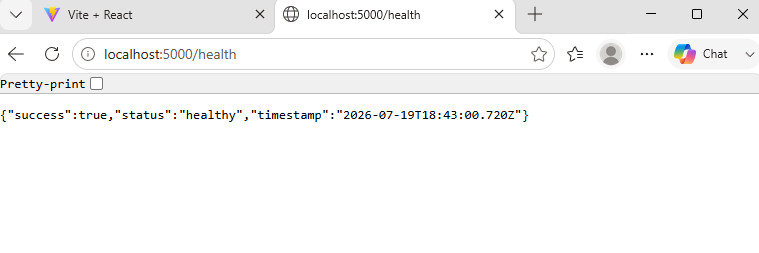

# Testing, Logging, and Monitoring

## Project Team

- Ameer Mresat
- Mohamed Kharanba

## 1. Overview

This document describes the testing, logging, health-checking, metrics, and monitoring strategy of the Full Stack Exam Management System.

The project currently includes:

- Manual backend API verification.
- Manual frontend workflow verification.
- PostgreSQL connectivity checks.
- Frontend production-build verification.
- Backend and frontend Docker-image builds.
- GitHub Actions workflow checks.
- Kubernetes health and readiness foundations.
- Morgan HTTP request logging.
- Prometheus-compatible backend metrics.
- Prometheus deployment configuration.
- Grafana deployment configuration.

The project does not yet contain a complete automated frontend or backend unit-test suite.

This limitation is documented honestly and is included in the future improvement plan.

---

## 2. Testing Objectives

The testing strategy aims to verify:

- The backend starts successfully.
- PostgreSQL is reachable.
- Authentication works.
- Role authorization works.
- Lecturers can manage exams.
- Lecturers can manage questions.
- Students can start and submit exams.
- Auto-save stores answers.
- Lecturers can grade submissions.
- Students can view published results.
- The frontend builds successfully.
- Docker images build successfully.
- Kubernetes manifests are structurally valid.
- Terraform configuration is formatted and valid.
- Monitoring endpoints respond correctly.
- Sensitive data is not exposed.

---

## 3. Current Testing Status

| Testing Area | Current Status |
| --- | --- |
| Backend startup verification | Implemented manually |
| PostgreSQL connectivity test | Implemented |
| Health endpoint verification | Implemented |
| Readiness endpoint verification | Implemented |
| Authentication verification | Implemented manually |
| Role authorization verification | Implemented manually |
| Lecturer API verification | Implemented manually |
| Student API verification | Implemented manually |
| Grading API verification | Implemented manually |
| Frontend page verification | Implemented manually |
| Frontend production build | Implemented |
| Backend Docker build | Implemented |
| Frontend Docker build | Implemented |
| GitHub Actions Docker build | Implemented |
| Terraform format validation | Configured |
| Terraform validation | Configured |
| Kubernetes dry-run validation | Available |
| Backend automated unit tests | Not complete |
| Frontend automated unit tests | Not complete |
| Automated end-to-end tests | Not complete |
| Automated load tests | Not complete |
| Automated security tests | Not complete |

---

# Local Environment Verification

## 4. Required Local Services

The local development environment requires:

- PostgreSQL.
- Node.js.
- npm.
- Backend dependencies.
- Frontend dependencies.

Optional tools include:

- Docker.
- Minikube.
- kubectl.
- Terraform.
- curl.
- jq.

---

## 5. Start PostgreSQL

Start PostgreSQL:

```bash
sudo service postgresql start
```

Check its status:

```bash
sudo service postgresql status
```

A successful result should show that PostgreSQL is running.

---

## 6. Install Backend Dependencies

Run from the project root:

```bash
npm --prefix backend ci
```

This command uses:

```text
backend/package-lock.json
```

It installs the exact dependency versions recorded in the lock file.

---

## 7. Install Frontend Dependencies

Run:

```bash
npm --prefix frontend ci
```

This command uses:

```text
frontend/package-lock.json
```

A successful installation finishes without an npm installation error.

`npm audit` warnings should be reviewed separately.

Warnings do not automatically mean that the application build failed.

---

## 8. Start the Backend

Run:

```bash
npm --prefix backend run dev
```

The backend normally listens on:

```text
http://localhost:5000
```

Expected startup behavior:

- Environment variables load.
- Express application starts.
- Port `5000` begins listening.
- No unhandled application exception appears.
- PostgreSQL requests can be performed.

---

## 9. Start the Frontend

In another terminal:

```bash
npm --prefix frontend run dev
```

The frontend normally runs at:

```text
http://localhost:5173
```

Expected behavior:

- Vite starts successfully.
- The login page opens.
- React Router loads the correct pages.
- Frontend requests reach the backend.

---

# Health and Readiness Testing

## 10. Backend Health Check

Endpoint:

```text
GET /health
```

Command:

```bash
curl -i http://localhost:5000/health
```

Expected result:

```text
HTTP 200
```

Example logical response:

```json
{
  "status": "healthy",
  "service": "exam-management-backend"
}
```

The health endpoint confirms that the backend application process is running.

It does not necessarily prove that PostgreSQL is connected.

---

## 11. Backend Readiness Check

Endpoint:

```text
GET /ready
```

Command:

```bash
curl -i http://localhost:5000/ready
```

Expected result:

```text
HTTP 200
```

The readiness endpoint is intended to indicate whether the backend can receive application traffic.

Kubernetes may use this endpoint as a readiness probe.

---

## 12. API Status Check

Endpoint:

```text
GET /api
```

Command:

```bash
curl -i http://localhost:5000/api
```

Expected result:

- HTTP status `200`.
- JSON response identifying that the API is running.

---

## 13. PostgreSQL Connectivity Check

Endpoint:

```text
GET /api/db-check
```

Command:

```bash
curl -i http://localhost:5000/api/db-check
```

Expected result:

```text
HTTP 200
```

Example logical response:

```json
{
  "success": true,
  "database": "connected"
}
```

This test verifies:

- The backend is running.
- `DATABASE_URL` is configured.
- PostgreSQL is reachable.
- The backend can execute a query.

The response must not reveal:

- Database password.
- Complete connection string.
- Internal database credentials.

---

## 14. Metrics Endpoint Check

Endpoint:

```text
GET /metrics
```

Command:

```bash
curl -s http://localhost:5000/metrics | head -n 30
```

Expected output contains Prometheus text format.

Example metric categories may include:

```text
process_cpu_user_seconds_total
process_resident_memory_bytes
nodejs_eventloop_lag_seconds
http_requests_total
```

The exact metric names depend on the current backend implementation.

---

# Authentication Testing

## 15. Registration Test

Endpoint:

```text
POST /api/auth/register
```

Example:

```bash
curl -i \
  -X POST \
  http://localhost:5000/api/auth/register \
  -H 'Content-Type: application/json' \
  -d '{
    "fullName": "Test Student",
    "email": "test.student@example.com",
    "password": "StrongPassword123!",
    "role": "STUDENT"
  }'
```

Verify:

- The response is JSON.
- A user is created.
- The role is correct.
- A JWT is returned when supported by the implementation.
- The password is not returned.
- `password_hash` is not returned.

---

## 16. Duplicate Registration Test

Repeat the same registration request.

Expected behavior:

- The second request is rejected.
- The database unique email constraint remains protected.
- The response does not expose SQL details.

Possible expected status:

```text
HTTP 409
```

---

## 17. Login Test

Endpoint:

```text
POST /api/auth/login
```

Example:

```bash
curl -i \
  -X POST \
  http://localhost:5000/api/auth/login \
  -H 'Content-Type: application/json' \
  -d '{
    "email": "test.student@example.com",
    "password": "StrongPassword123!"
  }'
```

Verify:

- Valid credentials succeed.
- JWT is returned.
- User information is returned.
- Password data is not returned.

---

## 18. Invalid Login Test

Use an incorrect password.

Verify:

- Authentication fails.
- No JWT is returned.
- The response does not reveal whether the email or password specifically was incorrect.
- Internal database details are not exposed.

---

## 19. Current User Test

Endpoint:

```text
GET /api/auth/me
```

Example:

```bash
curl -i \
  http://localhost:5000/api/auth/me \
  -H 'Authorization: Bearer <JWT>'
```

Verify:

- A valid token returns the authenticated user.
- An invalid token is rejected.
- A missing token is rejected.
- An expired token is rejected.

---

# Authorization Testing

## 20. Role Authorization Matrix

| Operation | Student | Lecturer | Administrator |
| --- | --- | --- | --- |
| View available exams | Allowed | Not a student action | Not a student action |
| Start exam | Allowed | Denied | Denied unless specially supported |
| Submit exam | Allowed | Denied | Denied unless specially supported |
| Create exam | Denied | Allowed | Allowed |
| Edit exam | Denied | Allowed for owned exam | Allowed |
| Add question | Denied | Allowed for owned exam | Allowed |
| Grade submission | Denied | Allowed for owned exam | Allowed |
| Access admin dashboard | Denied | Denied | Allowed |

---

## 21. Missing Token Test

Call a protected endpoint without:

```text
Authorization: Bearer <JWT>
```

Expected result:

- Request is rejected.
- Protected data is not returned.

Possible status:

```text
HTTP 401
```

---

## 22. Incorrect Role Test

Use a student JWT with:

```text
POST /api/exams
```

Expected result:

- Request is rejected.
- No exam is created.

Possible status:

```text
HTTP 403
```

---

## 23. Resource Ownership Test

Create or use two lecturer accounts.

Verify that lecturer A cannot:

- Edit lecturer B's exam.
- Delete lecturer B's exam.
- Add questions to lecturer B's exam.
- View private grading details for lecturer B's exam.
- Grade lecturer B's submissions.

The backend must verify ownership using database data.

The frontend is not trusted as the final authorization layer.

---

# Lecturer Workflow Testing

## 24. Create Exam Test

Endpoint:

```text
POST /api/exams
```

Verify:

- A lecturer can create an exam.
- The lecturer ID comes from the authenticated user.
- Initial status is `DRAFT`.
- Duration is positive.
- End time is after start time.
- Invalid data is rejected.

---

## 25. View Lecturer Exams Test

Endpoint:

```text
GET /api/exams/my
```

Verify:

- The lecturer receives owned exams.
- Exams from unauthorized lecturers are not included.
- The response is JSON.
- Status and schedule values are correct.

---

## 26. Update Exam Test

Endpoint:

```text
PUT /api/exams/:id
```

Verify:

- The owner can update the exam.
- Another lecturer cannot update it.
- Invalid dates are rejected.
- Invalid duration is rejected.

---

## 27. Publish Exam Test

Endpoint:

```text
PATCH /api/exams/:id/publish
```

Verify the status transition:

```text
DRAFT → PUBLISHED
```

Verify:

- The exam owner can publish.
- A student cannot publish.
- Another lecturer cannot publish.
- The updated status is stored in PostgreSQL.

---

## 28. Add Question Test

Endpoint:

```text
POST /api/exams/:examId/questions
```

Verify:

- The question belongs to the selected exam.
- Points are stored.
- Position is stored.
- Options are stored.
- Correct-option information is stored only for authorized use.
- Duplicate positions are rejected.

---

## 29. Question Transaction Test

For a multiple-choice question:

- Create the question.
- Create its answer options.
- Cause an option validation failure.

Verify:

- The operation does not leave incomplete option data.
- A transaction rolls back related inserts when implemented.

---

# Student Workflow Testing

## 30. Available Exams Test

Endpoint:

```text
GET /api/student/exams/available
```

Verify:

- Only relevant published exams appear.
- Draft exams do not appear.
- Closed exams do not appear as available.
- Exam scheduling rules are applied.
- Student role is required.

---

## 31. Start Exam Test

Endpoint:

```text
POST /api/student/exams/:examId/start
```

Verify:

- An exam session is created.
- A submission is created.
- Submission status is `IN_PROGRESS`.
- Expiration is calculated.
- The student cannot start an unavailable exam.
- Duplicate conflicting sessions are prevented.

---

## 32. Student-Safe Exam Test

Endpoint:

```text
GET /api/student/exams/:examId
```

Verify that the response does not contain:

```text
correctAnswer
isCorrect
```

This is a critical security test.

The student may receive:

- Question text.
- Question type.
- Points.
- Option text.
- Option order.

The student must not receive the answer key.

---

## 33. Auto-Save Test

Endpoint:

```text
PATCH /api/submissions/:submissionId/auto-save
```

Verify:

- Answers are inserted.
- Existing answers are updated.
- Duplicate answer records are prevented.
- The student owns the submission.
- The submission is still `IN_PROGRESS`.
- Invalid questions are rejected.
- Another student cannot edit the submission.

---

## 34. Submit Exam Test

Endpoint:

```text
POST /api/submissions/:submissionId/submit
```

Verify status transition:

```text
IN_PROGRESS → SUBMITTED
```

Verify:

- `submittedAt` is set.
- The exam session is finalized when supported.
- Another student cannot submit the submission.
- Repeated final submission is rejected or safely handled.
- Editing after submission is prevented.

---

# Grading and Results Testing

## 35. Submission List Test

Endpoint:

```text
GET /api/exams/:examId/submissions
```

Verify:

- The lecturer receives submissions for an owned exam.
- Another lecturer cannot access the list.
- Student information is correctly connected.
- Submission status is correct.

---

## 36. Submission Details Test

Endpoint:

```text
GET /api/submissions/:id
```

Verify:

- Authorized lecturer receives answers and questions.
- Correct-answer information is restricted to authorized grading users.
- Unauthorized lecturers cannot access it.
- Students cannot access lecturer grading details.

---

## 37. Answer Grading Test

Endpoint:

```text
PATCH /api/answers/:answerId/grade
```

Verify:

- Non-negative score is accepted.
- Negative score is rejected.
- Score above question points is rejected.
- Feedback is stored.
- Unauthorized lecturer is rejected.

---

## 38. Submission Grading Test

Endpoint:

```text
PATCH /api/submissions/:id/grade
```

Verify status transition:

```text
SUBMITTED → GRADED
```

Verify:

- Total score is stored.
- Feedback is stored.
- `gradedAt` is stored.
- `gradedBy` identifies the grader.
- Invalid total score is rejected.

---

## 39. Publish Results Test

Endpoint:

```text
PATCH /api/exams/:id/publish-results
```

Verify status transition:

```text
CLOSED → RESULTS_PUBLISHED
```

Verify:

- The owner can publish results.
- Unauthorized users cannot publish results.
- The new status is stored.

---

## 40. Student Result Test

Endpoint:

```text
GET /api/submissions/:id/result
```

Verify:

- Student owns the submission.
- Submission is graded.
- Exam results are published.
- Score and feedback are displayed.
- Another student cannot access the result.
- Results are not returned before publication.

---

# Frontend Testing

## 41. Public Page Verification

Verify:

```text
/login
/register
/unauthorized
```

Check:

- Pages render.
- Forms accept input.
- Validation messages display.
- Navigation works.
- API errors display clearly.

---

## 42. Protected Route Verification

Verify:

- Logged-out user is redirected to `/login`.
- Student cannot access lecturer routes.
- Lecturer cannot access student-only exam participation.
- Non-admin user cannot access `/admin/dashboard`.
- Unauthorized access redirects to `/unauthorized`.

Backend authorization must still be tested separately.

---

## 43. Student Page Verification

Verify:

```text
/student/dashboard
/student/exams
/student/exams/:id/take
/student/submissions
/student/results/:submissionId
```

Check:

- Available exams load.
- Exam questions render.
- Answers can be entered.
- Auto-save feedback appears.
- Submission completes.
- Previous submissions display.
- Published results display.

---

## 44. Lecturer Page Verification

Verify:

```text
/lecturer/dashboard
/lecturer/exams
/lecturer/exams/create
/lecturer/exams/:id/questions
/lecturer/exams/:id/submissions
/lecturer/submissions/:id/grade
```

Check:

- Exam creation works.
- Exam list loads.
- Question management works.
- Submission list loads.
- Grading controls work.
- Status changes display correctly.

---

## 45. Frontend Production Build

Run:

```bash
npm --prefix frontend ci
npm --prefix frontend run build
```

The verified local build produced:

```text
vite building for production
113 modules transformed
dist/index.html
dist/assets/
built successfully
```

A successful build creates:

```text
frontend/dist/
```

---

# Docker Testing

## 46. Backend Docker Build

Run from the project root:

```bash
docker build \
  --no-cache \
  -t exam-backend:test \
  -f backend/Dockerfile \
  .
```

Verify:

- Dependencies install.
- Source files copy.
- Image builds.
- Port `5000` is exposed.
- Startup command is correct.

---

## 47. Frontend Docker Build

Run:

```bash
docker build \
  --no-cache \
  -t exam-frontend:test \
  ./frontend
```

The verified build completed:

```text
npm ci
npm run build
Nginx production stage
Successfully built
Successfully tagged exam-frontend:test
```

The frontend image uses:

```text
Node.js build stage
Nginx production stage
```

---

## 48. Docker Image Check

List the images:

```bash
docker images | grep exam-
```

Expected image examples:

```text
exam-backend:test
exam-frontend:test
```

---

## 49. Frontend Container Test

Run:

```bash
docker run \
  --rm \
  --name exam-frontend-test \
  -p 8080:80 \
  exam-frontend:test
```

Open:

```text
http://localhost:8080
```

Verify:

- Nginx serves the frontend.
- React Router routes use the configured fallback.
- Static assets load.

---

# GitHub Actions Testing

## 50. Current GitHub Actions Verification

The repository contains a Docker Build workflow.

The workflow:

1. Checks out the repository.
2. Builds the backend image.
3. Builds the frontend image.

The Docker Build workflow was re-run and completed successfully on:

```text
Branch:
feature/final-documentation

Result:
Success
```

This proves that GitHub Actions can build both application Docker images from the repository state used by that workflow run.

---

## 51. Workflow Trigger

The Docker workflow is triggered on events such as:

```yaml
on:
  push:
  pull_request:
```

Therefore, documentation commits may also trigger Docker image builds.

This is expected because the workflow currently reacts to every push unless path filters are configured.

---

## 52. Docker Workflow Commands

Logical commands:

```bash
docker build \
  -t exam-backend:ci \
  -f backend/Dockerfile \
  .
```

```bash
docker build \
  -t exam-frontend:ci \
  ./frontend
```

---

## 53. Temporary Workflow Failure

A previous Docker workflow run failed during a frontend-image build.

Local verification showed:

- `npm ci` succeeded.
- Vite production build succeeded.
- Frontend Docker image build succeeded.

The failed GitHub Actions job was re-run without a source-code change and completed successfully.

This indicates that the earlier failure was temporary rather than a confirmed source-code defect.

---

## 54. Recommended Workflow Improvement

The workflow may use path filters to avoid running Docker builds for documentation-only changes.

Example logical configuration:

```yaml
on:
  push:
    paths:
      - "backend/**"
      - "frontend/**"
      - ".github/workflows/docker-build.yml"
  pull_request:
    paths:
      - "backend/**"
      - "frontend/**"
      - ".github/workflows/docker-build.yml"
```

This improvement is optional.

Running the workflow on all pushes provides broader verification but consumes more workflow time.

---

# Kubernetes Testing

## 55. Kubernetes Client Validation

Run:

```bash
kubectl apply \
  --dry-run=client \
  -f k8s/
```

This checks whether Kubernetes can parse the resource definitions.

Some directories may contain templates or example secrets that need to be tested individually.

---

## 56. Kubernetes Resource Verification

After applying resources:

```bash
kubectl get all -n exam-system
```

Check:

```bash
kubectl get pods -n exam-system
kubectl get services -n exam-system
kubectl get deployments -n exam-system
kubectl get pvc -n exam-system
kubectl get ingress -n exam-system
```

---

## 57. Kubernetes Pod Readiness

Wait for pods:

```bash
kubectl wait \
  --for=condition=Ready \
  pod \
  --all \
  -n exam-system \
  --timeout=180s
```

If a pod does not become ready:

```bash
kubectl describe pod \
  -n exam-system \
  <pod-name>
```

---

## 58. Kubernetes Backend Test

Port forward:

```bash
kubectl port-forward \
  -n exam-system \
  service/backend \
  5000:5000
```

Then verify:

```bash
curl http://localhost:5000/health
curl http://localhost:5000/ready
curl http://localhost:5000/api/db-check
curl http://localhost:5000/metrics
```

---

# Terraform Testing

## 59. Terraform Formatting

Run:

```bash
terraform \
  -chdir=terraform/gcp-gke \
  fmt \
  -check \
  -recursive
```

A successful result means Terraform files follow the expected formatting.

---

## 60. Terraform Initialization

For validation without using a remote backend:

```bash
terraform \
  -chdir=terraform/gcp-gke \
  init \
  -backend=false
```

---

## 61. Terraform Validation

Run:

```bash
terraform \
  -chdir=terraform/gcp-gke \
  validate
```

A successful validation confirms that the configuration is structurally valid.

It does not prove that cloud resources were created.

---

## 62. Terraform Plan

Run:

```bash
terraform \
  -chdir=terraform/gcp-gke \
  plan
```

Review:

- Resources to be created.
- Resources to be changed.
- Resources to be destroyed.
- Project ID.
- Region and zone.
- Required APIs.
- IAM permissions.
- Estimated cloud cost.

Terraform apply should not be performed without reviewing the plan.

---

# Logging

## 63. Backend HTTP Logging

The backend uses Morgan.

Morgan records HTTP request information.

A typical log may include:

```text
HTTP method
Request path
HTTP status
Response size
Request duration
```

Example logical log:

```text
GET /health 200
POST /api/auth/login 200
GET /api/student/exams/available 200
```

---

## 64. Development and Production Log Formats

Development mode may use:

```text
dev
```

Production mode may use:

```text
combined
```

The production format includes more request metadata.

Environment selection is controlled through:

```text
NODE_ENV
```

---

## 65. Information That Must Not Be Logged

Logs must not contain:

- Plain-text passwords.
- Password hashes.
- JWT tokens.
- JWT secrets.
- Database passwords.
- Complete database connection strings.
- Private keys.
- Google Cloud service-account keys.
- Kubernetes Secret values.
- Sensitive personal information.
- Correct exam answers in unnecessary logs.

---

## 66. Local Backend Logs

Run the backend directly:

```bash
npm --prefix backend run dev
```

The terminal displays application and HTTP logs.

To save logs temporarily:

```bash
npm --prefix backend run dev \
  2>&1 | tee /tmp/exam-backend.log
```

Temporary local logs should not be committed.

---

## 67. Docker Logs

Backend container logs:

```bash
docker logs exam-backend
```

Follow logs:

```bash
docker logs \
  --follow \
  exam-backend
```

Frontend Nginx logs:

```bash
docker logs exam-frontend
```

---

## 68. Kubernetes Logs

Backend logs:

```bash
kubectl logs \
  -n exam-system \
  deployment/backend
```

Follow logs:

```bash
kubectl logs \
  -n exam-system \
  deployment/backend \
  --follow
```

Previous container logs:

```bash
kubectl logs \
  -n exam-system \
  <pod-name> \
  --previous
```

All pod containers:

```bash
kubectl logs \
  -n exam-system \
  <pod-name> \
  --all-containers
```

---

## 69. Kubernetes Events

Show namespace events:

```bash
kubectl get events \
  -n exam-system \
  --sort-by=.metadata.creationTimestamp
```

Events help identify:

- Image-pull failures.
- Missing Secrets.
- Volume failures.
- Scheduling failures.
- Probe failures.
- Container restarts.

---

# Monitoring

## 70. Prometheus Architecture

The backend exposes metrics at:

```text
GET /metrics
```

Prometheus periodically scrapes this endpoint.

Logical flow:

```text
Express Backend
       |
       | /metrics
       v
Prometheus
       |
       v
Time-Series Database
       |
       v
Grafana
```

---

## 71. Backend Metrics

The backend uses:

```text
prom-client
```

Metrics may include:

- Process CPU usage.
- Process memory usage.
- Node.js event-loop data.
- Garbage-collection information.
- HTTP request count.
- HTTP response statuses.
- Request route.
- Request method.

---

## 72. Prometheus Verification

Port forward Prometheus:

```bash
kubectl port-forward \
  -n exam-system \
  service/prometheus \
  9090:9090
```

Open:

```text
http://localhost:9090
```

Verify:

- Prometheus opens.
- Backend target is visible.
- Target status is `UP`.
- Queries return metric data.

The exact Service name must match the Kubernetes manifest.

---

## 73. Prometheus Target Check

Inside Prometheus, inspect:

```text
Status → Targets
```

Expected backend target:

```text
backend-service:5000/metrics
```

Possible failure causes:

- Incorrect Service name.
- Incorrect namespace.
- Incorrect port.
- Incorrect metrics path.
- Backend pod not ready.
- NetworkPolicy blocking traffic.

---

## 74. Grafana Verification

Port forward Grafana:

```bash
kubectl port-forward \
  -n exam-system \
  service/grafana \
  3000:3000
```

Open:

```text
http://localhost:3000
```

Verify:

- Grafana opens.
- Prometheus data source is configured.
- Dashboard panels can query metrics.
- No production password is committed to Git.

---

## 75. Suggested Grafana Panels

Useful panels include:

- Total HTTP requests.
- Requests per minute.
- Successful responses.
- Client errors.
- Server errors.
- Backend memory usage.
- Backend CPU usage.
- Node.js event-loop lag.
- Pod restart count.
- Pod availability.
- Database connectivity failures.

---

## 76. Suggested Alerts

Future production alerts may include:

```text
Backend unavailable
High HTTP 5xx rate
High response time
Repeated pod restarts
PostgreSQL unavailable
High memory usage
High CPU usage
Disk storage nearly full
Prometheus target down
```

Production alert delivery is not yet configured.

---

# Test Evidence

## 77. Current Verification Evidence

The project currently has evidence for:

- Backend health response.
- Backend readiness response.
- PostgreSQL connectivity.
- Authentication.
- Lecturer exam creation.
- Question creation.
- Student pages.
- Lecturer pages.
- Grading page.
- Frontend production build.
- Frontend Docker build.
- GitHub Actions Docker build success.
- Architecture diagrams.
- Screenshots.

---

## 78. Backend Health Screenshot

The planned screenshot is:

```text
docs/screenshots/12-backend-health.png
```

When committed, it can be displayed as:

```markdown

```

---

## 79. Application Screenshot Set

The screenshot folder contains or is planned to contain:

```text
01-login-page.png
02-register-page.png
03-student-dashboard.png
04-available-exams.png
05-take-exam.png
06-student-submissions.png
07-lecturer-dashboard.png
08-lecturer-exams.png
09-create-exam.png
10-question-management.png
11-submission-grading.png
12-backend-health.png
```

These screenshots provide visual evidence of the main project workflows.

---

# Automated Test Plan

## 80. Backend Unit-Test Plan

A future backend test suite should test services and validators.

Recommended tools:

```text
Jest
Supertest
Test PostgreSQL database
```

Recommended areas:

- Authentication validation.
- Password hashing.
- JWT verification.
- Role middleware.
- Exam validation.
- Exam ownership.
- Question validation.
- Student-safe responses.
- Auto-save.
- Submission status transitions.
- Grading score validation.
- Result-publication rules.

---

## 81. Backend Integration-Test Plan

Integration tests should start the Express application and send HTTP requests.

Example logical test:

```text
Register Lecturer
      |
      v
Login Lecturer
      |
      v
Create Exam
      |
      v
Add Question
      |
      v
Publish Exam
      |
      v
Register Student
      |
      v
Start Exam
      |
      v
Submit Exam
      |
      v
Grade Submission
      |
      v
Publish Results
      |
      v
Student Reads Result
```

---

## 82. Frontend Unit-Test Plan

Recommended tools:

```text
Vitest
React Testing Library
```

Recommended tests:

- Login form.
- Registration form.
- ProtectedRoute.
- Role-based redirects.
- Navbar links.
- Exam form validation.
- Question form.
- Student answer controls.
- Auto-save status.
- Grading inputs.
- Loading and error states.

---

## 83. End-to-End Test Plan

Recommended tool:

```text
Playwright
```

Possible end-to-end scenarios:

1. Lecturer creates and publishes an exam.
2. Student starts and submits the exam.
3. Lecturer grades the submission.
4. Lecturer publishes results.
5. Student views the grade.

---

## 84. Load-Test Plan

Recommended tools:

```text
k6
Apache JMeter
```

Useful load scenarios:

- Many students logging in.
- Many students loading available exams.
- Many students starting an exam.
- Frequent auto-save requests.
- Many simultaneous submissions.
- Lecturer loading a large submission list.

Load testing is not currently implemented.

---

## 85. Security-Test Plan

Future security tests should include:

- JWT tampering.
- Expired JWT.
- Missing JWT.
- Incorrect role.
- Resource-ownership bypass attempts.
- SQL-injection inputs.
- Cross-site scripting input.
- Rate-limit verification.
- CORS verification.
- Sensitive-response-field checks.
- Secret scanning.
- Dependency scanning.
- Container-image scanning.

---

# Current Limitations

## 86. Testing Limitations

The current project does not yet contain:

- Complete backend unit tests.
- Complete backend integration tests.
- Complete frontend unit tests.
- Automated browser tests.
- Automated load tests.
- Automated penetration tests.
- Automated database migration tests.
- Production monitoring validation.
- Production alert delivery.
- Production backup testing.
- Disaster-recovery testing.

---

## 87. Logging Limitations

Current logging is mainly request-focused.

Future improvements include:

- Structured JSON logs.
- Request correlation IDs.
- Centralized log collection.
- Log retention policy.
- Log-level configuration.
- Audit-event integration.
- Cloud Logging integration.
- Sensitive-field redaction.

---

## 88. Monitoring Limitations

Current monitoring is a foundation.

Future improvements include:

- Production Prometheus verification.
- Production Grafana dashboards.
- Alertmanager.
- Notification channels.
- Database metrics.
- Frontend monitoring.
- Distributed tracing.
- Service-level objectives.
- Uptime monitoring.
- Error-budget tracking.

---

## 89. Final Testing Statement

The project includes meaningful manual verification, build verification, Docker verification, health checks, metrics, logging, and monitoring configuration.

The documentation does not claim that a complete automated test suite exists.

The main production-quality improvement required is the implementation of automated:

- Backend unit tests.
- Backend integration tests.
- Frontend unit tests.
- End-to-end tests.
- Load tests.
- Security tests.

The existing architecture makes these future additions possible without changing the main application design.