# Application Screenshots

## Authentication

### Login Page

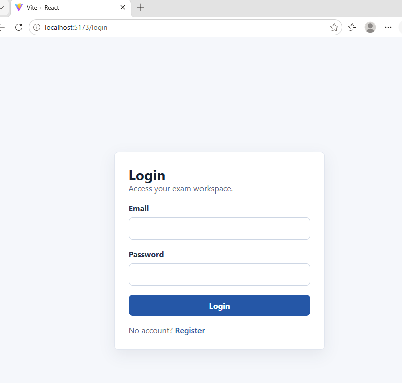

### Registration Page

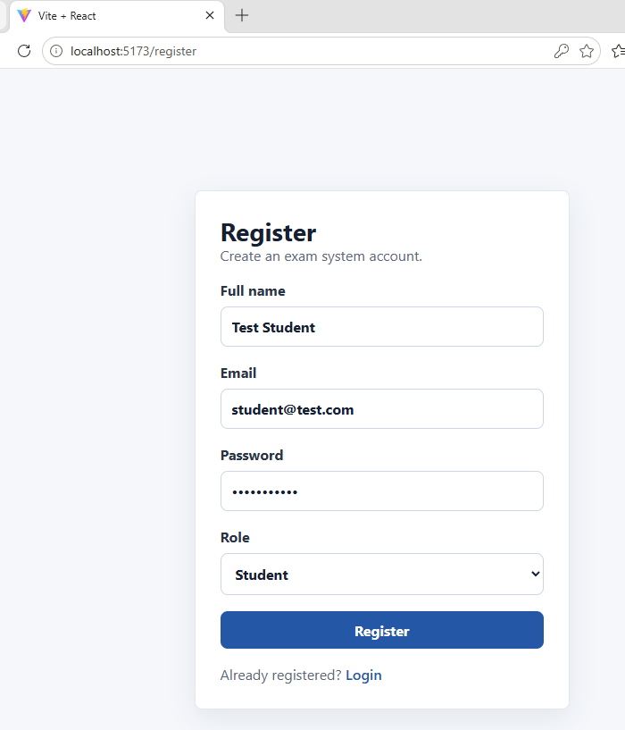

---

## Student Workflow

### Student Dashboard

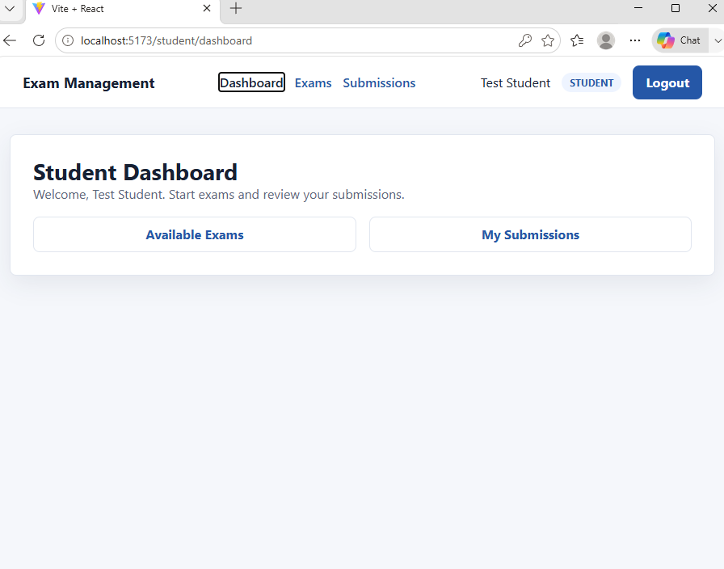

### Available Exams

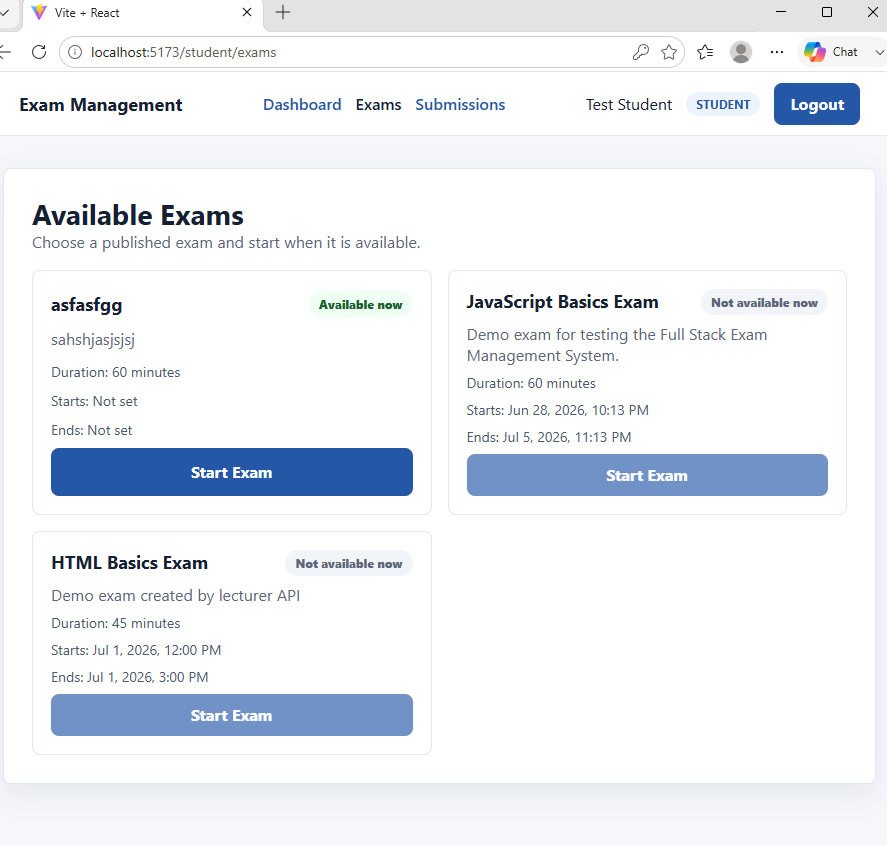

### Take Exam

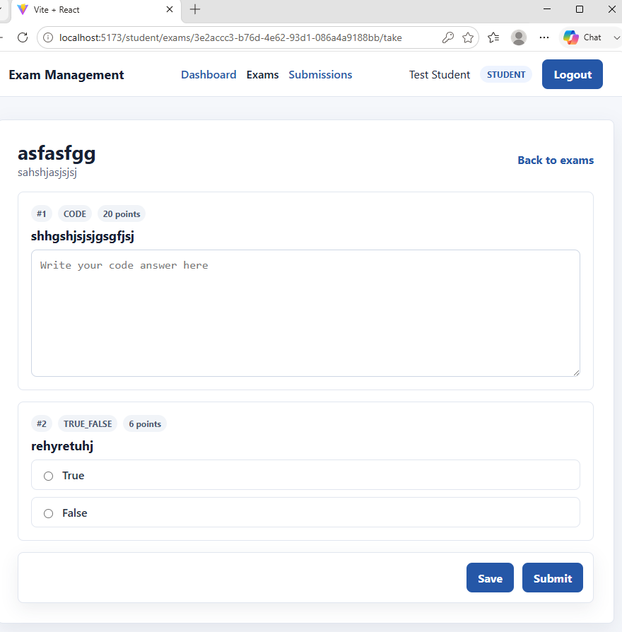

### Student Submissions

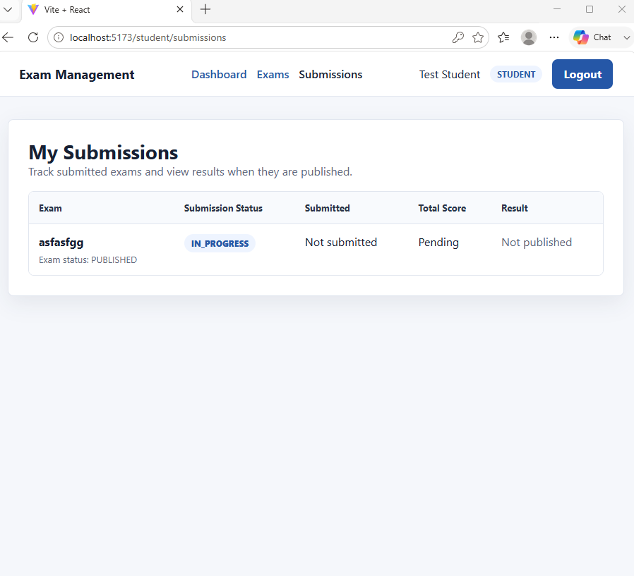

---

## Lecturer Workflow

### Lecturer Dashboard

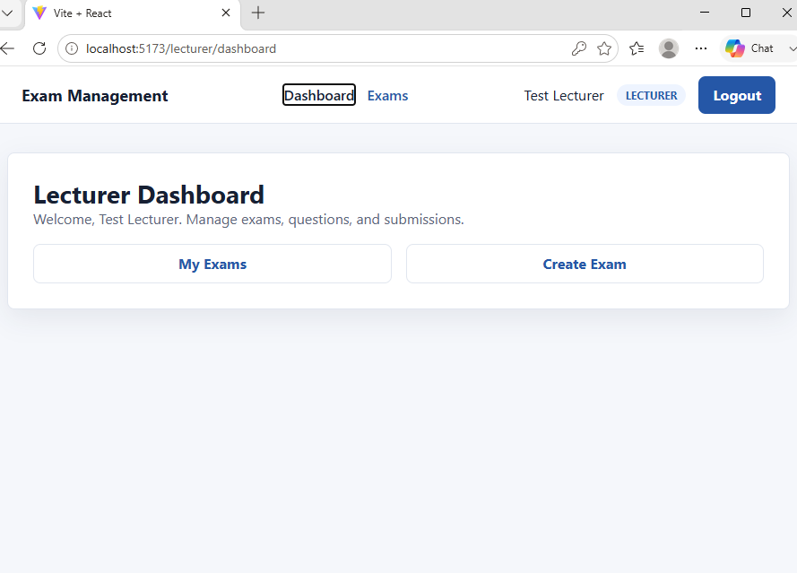

### Lecturer Exams

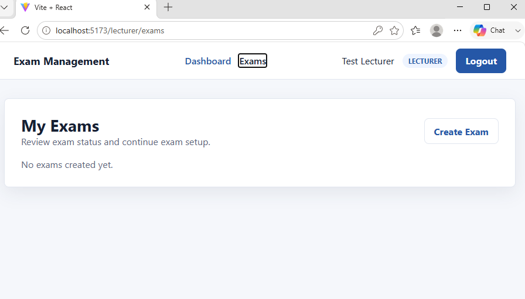

### Create Exam

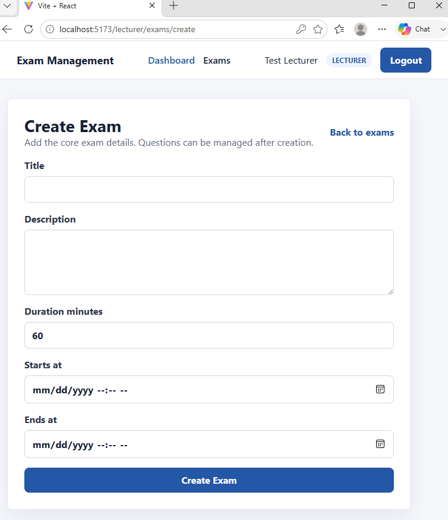

### Question Management

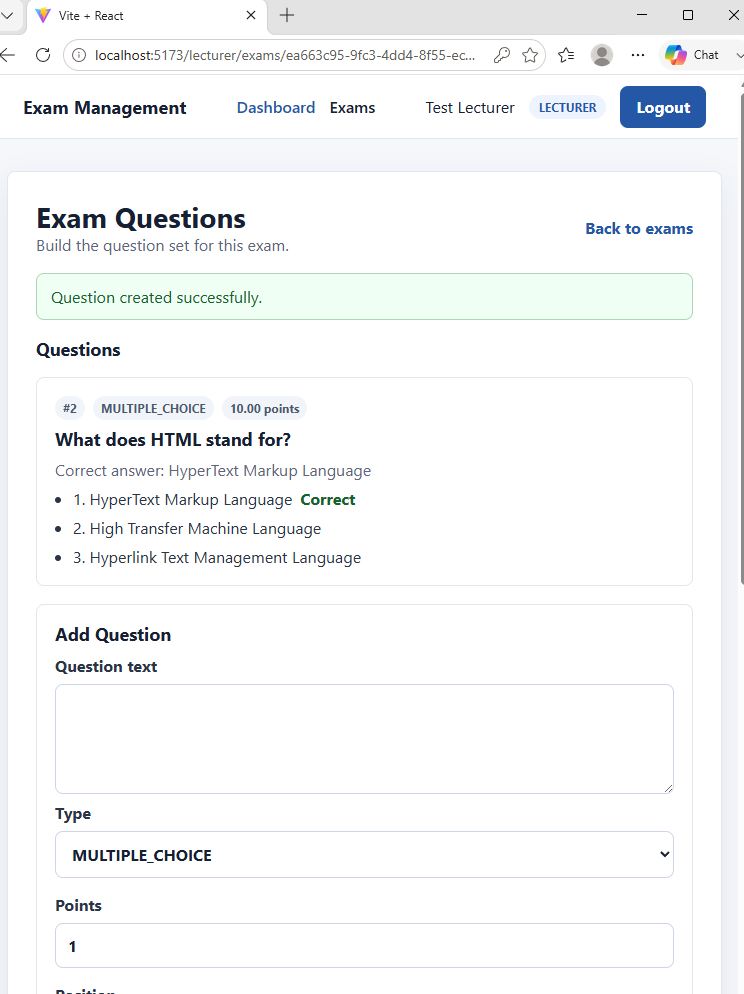

### Submission Grading

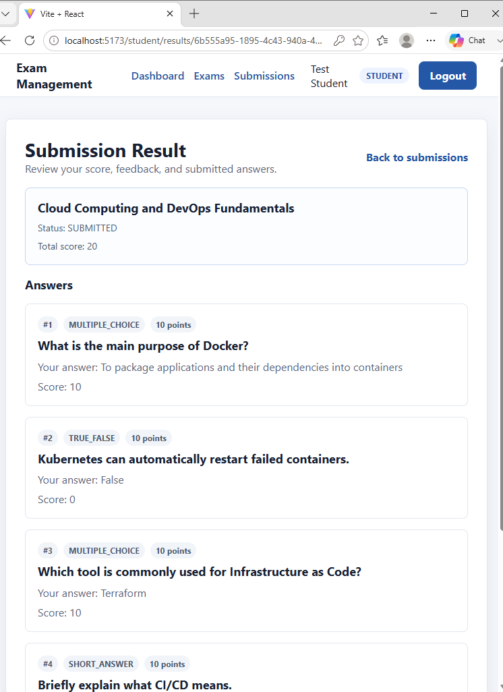

---

## Backend Verification

### Backend Health Endpoint

